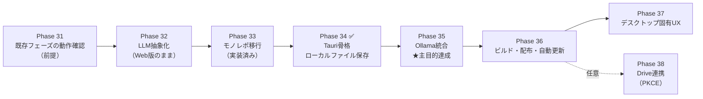

# IdeaMap デスクトップアプリ版 — 計画の入口

**このディレクトリは「Web版とデスクトップ版でコアを共通化しながら、ローカルLLM（Ollama）対応のデスクトップ版を作る」ための設計群です。**
作業を始める AI エージェント・開発者は、まず本ファイルを読んでから個別ドキュメントに進んでください。

最終更新: 2026-08-07

---

## 0. なぜデスクトップ版を作るのか

**ローカルLLM（Ollama, `http://localhost:11434`）を使いたいから**です。これが唯一かつ最大の動機です。

ブラウザから `localhost` の Ollama を叩く構成は CORS 設定（`OLLAMA_ORIGINS`）にユーザー側の環境依存が強く、GitHub Pages 配信の Web 版では安定して提供できません。Tauri の Rust プロセス経由（`tauri-plugin-http`）であればブラウザの CORS 制約を受けずにアクセスできます。

副次的な効果として、ローカルファイル中心の編集・OSキーチェーンによる APIキー保管・ウィンドウ状態の記憶などが手に入ります。

---

## 1. ドキュメント構成と読む順序

| # | ドキュメント | 扱う範囲 | 読むべき人 |
|---|---|---|---|
| 1 | [adr-001-framework-selection.md](adr-001-framework-selection.md) | **なぜ Tauri v2 なのか。** 候補比較（Tauri / Electron / Wails / Neutralino / PWA）、決定理由、懸念と対策、結論を覆す条件 | 技術選定の背景を知りたい人。実装時は読まなくてよい |
| 2 | [architecture.md](architecture.md) | **モノレポ構成とプラットフォーム抽象化。** 現状コードの依存棚卸し、`packages/*` `apps/*` の責務、Platform Adapter インタフェース定義、pnpm/TS/Vite/Tailwind のツールチェーン、10ステップの移行手順 | **全員必読。** 構成の土台 |
| 3 | [llm-abstraction.md](llm-abstraction.md) | **LLMプロバイダ抽象化。** `LLMProvider` インタフェース、`ClaudeProvider`/`OllamaProvider` 実装方針、構造化出力の差の吸収、`AIModel` 型の移行、設定UI、Ollama API 調査結果 | AI機能・Ollama連携を触る人 |
| 4 | [platform-integration.md](platform-integration.md) | **デスクトップ固有機能と配布。** ファイル管理モデル、OSキーチェーン、`tauri.conf.json`/capabilities の実例、GitHub Actions ビルド、自動更新、Windows 開発環境セットアップ | Tauri 側を触る人 |

既存の [../design.md](../design.md) / [../requirements.md](../requirements.md) / [../implementation-plan.md](../implementation-plan.md) が引き続き上位ドキュメントです。本ディレクトリはそれを補完する詳細設計であり、**置き換えるものではありません**。

---

## 2. 決定事項サマリ

| 項目 | 決定 | 根拠 |
|---|---|---|
| フレームワーク | **Tauri v2**（2026-07 時点の安定版 2.11.5） | `tauri-plugin-http` で Ollama へ CORS 制約なしにアクセスできる／既存 Vite+React 資産をほぼ無改修で流用できる／Electron 比でバンドル・メモリが小さい |
| リポジトリ構成 | **pnpm workspaces のモノレポ**。`packages/core` `packages/ui` `packages/platform` + `apps/web` `apps/desktop` | 依存の厳格さがそのまま「coreはUIに依存しない」というルールの強制装置になる |
| プラットフォーム差の吸収 | **Platform Adapter**（`StorageAdapter` / `FileAdapter` / `SecretAdapter` / `HttpAdapter` / `SystemAdapter`）を `setPlatform()` でシングルトン注入 | Zustand ストアが React ツリー外のプレーンモジュールとして設計済みのため、Context より自然 |
| LLM 抽象化 | `LLMProvider` インタフェース（`complete` / `completeJson` / `stream` / `listModels` / `capabilities`）に `ClaudeProvider` と `OllamaProvider` の2実装 | 構造化出力の方式差（Claude=プロンプト指示＋正規表現抽出 / Ollama=`format` にJSON Schema）を境界内に閉じ込める |
| デスクトップの保存先 | **ローカルファイル中心**（`.ideamap` 拡張子、実体はJSON）。ネイティブの開く/保存ダイアログ | Ollama利用者はローカル完結志向。`MapFile` 型は Web/Desktop 共通なのでファイル交換で相互運用できる |
| APIキーの保管 | デスクトップは **OSキーチェーン**（`keyring` crate）。マスターパスワード入力は不要になる | Stronghold 公式プラグインは非推奨化（v3で削除予定）のため不採用 |
| 配布 | GitHub Actions で Windows(MSI/NSIS)・macOS(dmg) をビルド → GitHub Releases → `tauri-plugin-updater` で自動更新。**当面はコード署名なし** | 個人開発。署名証明書は後から導入可能な移行パスを確保 |

---

## 3. 横断的な裁定（ドキュメント間の矛盾の解決）

4本のドキュメントは並行して書かれたため、以下3点で結論が食い違っています。**本節の裁定が優先されます。**

### 3.1 デスクトップ版の Google Drive 連携 → **v1 では非対応。将来フェーズで任意機能として追加**

- `architecture.md` §1.6・§3.4 は「Drive同期・GIS認証は Web専用として `apps/web` に閉じ込める」
- `platform-integration.md` §3.8 は「残す（オプションに格下げ、PKCEループバックで再実装）」

**裁定:** デスクトップ版 v1（Phase 34〜36）は **Drive 非対応**とし、`architecture.md` の配置方針（`apps/web` に閉じ込め）に従います。Web版で作ったマップは JSON エクスポート → デスクトップ版で「開く」で持ち込みます（`MapFile` 型が共通なので変換不要）。

理由は、Google の embedded WebView OAuth ブロック（`disallowed_useragent`）を回避するには「デスクトップアプリ種別のクライアントID発行＋ループバックサーバ＋PKCE」という新規実装が丸ごと必要で、Ollama対応という主目的から見て明らかにスコープ外だからです。

`platform-integration.md` §3.8 の設計は**破棄せず、Phase 38 の設計として有効**です。着手時にそこから読み始めてください。

### 3.1-B `LLMProvider` 実装時の4つの変更（Phase 32 実施済み・2026-08-05）

`llm-abstraction.md` の記述から意図的に変えた点が4つあります（中断時の `stream()` の返し方、`LLMError.name`、`maxContextTokens`、`toFriendlyAIError` の文言の置き場所）。**同ファイル §7 冒頭の表が優先されます。** そちらに理由とあわせて記載しています。

### 3.1-C モノレポ移行時の Adapter インタフェース変更（Phase 33 実施済み・2026-08-06）

`architecture.md` §3.1 の定義から意図的に変えた点が4つあります。**本節が優先されます。**

| 変更 | 内容 | 理由 |
|---|---|---|
| マップ内容の型 | `FileAdapter` の `openFile`/`saveFile`/`saveFileAs`/`saveLocalMirror` は `MapFile` ではなく `unknown` を受け渡す | `packages/platform` → `packages/core` の循環依存を避けるため。既存 `googleDriveService` も `saveMap(content: unknown)` で同じ扱いをしている |
| `SecretAdapter` の引数とメソッド | `getSecret(key, passphrase?)` / `setSecret(key, value, passphrase?)` に加え、`hasLegacySecret` / `getLegacySecret` / `clearLegacySecret` を追加 | Web のマスターパスワード方式（PBKDF2+AES-GCM）と Phase 27 以前のキー自動移行を維持するため。Desktop は passphrase を無視し、legacy 3メソッドは no-op / false / null を返す |
| `FileAdapter` の追加メソッド | `exportBlob(name, blob)` / `saveLocalMirror(content)` / `isRemoteReady` | `architecture.md` §1.2 は「`<a download>` は `saveFileAs` に置き換え可能」としていたが、`saveFileAs` はマップ本体の保存専用でシグネチャが合わないため、生成物（PNG/SVG/Markdown/JSON）の書き出しは別メソッドに分けた |
| `HttpAdapter.getFetch()` | `fetch` 互換関数そのものを返すメソッドを追加 | `@anthropic-ai/sdk` のように fetch 実装の差し替え口を持つライブラリへ渡すため。`ClaudeProvider` はこれで `packages/core` から `fetch` を直接呼ばずに済む |

あわせて、`settingsStore` の zustand `persist` は Phase 33 時点では **StorageAdapter に載せていません**。
非同期ストレージにするとハイドレーションが1マイクロタスク遅れ、初回描画がテーマ既定値で走ってちらつくためです。
Phase 33 の判定条件が「移行前と同じ動作」であることを優先し、Phase 34 で非同期ハイドレーション込みで対応します。

→ **Phase 34 で対応済み（2026-08-07）。** `storage` を StorageAdapter 経由の `createJSONStorage` にしたうえで `skipHydration: true` を付け、
`packages/core/src/stores/bootstrap.ts` の `restorePersistedState()` を各アプリの `main.tsx` が最初のレンダー前に await します。
自動ハイドレーションを止めて「復元してから描画する」順序に固定したので、ちらつきは起きません。

### 3.1-D Tauri 骨格実装時の設計判断（Phase 34 実施済み・2026-08-07）

`platform-integration.md` の記述から意図的に変えた点です。**本節が優先されます。**

| 変更 | 内容 | 理由 |
|---|---|---|
| capability の分割 | `main-window` / `file-access` / `ai-http` の3ファイル。`google-oauth` と `updater` は作らない | §3.1 の裁定で Drive はスコープ外、自動更新は Phase 36。`ollama-http` は Anthropic API と同じ「AIプロバイダへの通信」なので `ai-http` に統合した |
| ダイアログで選んだパスの `fs` 許可 | `fs:scope` はアプリ専用ディレクトリ（`$APPCONFIG` / `$APPLOCALDATA`）のみに絞り、ユーザーが選んだパスは dialog プラグインの実行時許可に任せる。それを次回起動へ引き継ぐため **`tauri-plugin-persisted-scope` を追加** | §8 #2 の「`$HOME/Documents/**` 等を明示追加」より攻撃面が狭い。「ユーザーが一度選んだファイルだけ」に限定できる |
| `FileAdapter.origin` の追加 | Adapter が扱う保存先の種別（`'cloud'` / `'local'`）を公開する | `useAutoSave` が `currentFileId` から `FileRef` を組み立てる際、`origin` を `'cloud'` 決め打ちにしていたため。3点（platform 型・web 実装・desktop 実装）を揃えて追加した |
| 自動保存の新規ファイル作成 | `AutoSaveOptions` に `createNewFileOnSave`（Web=true / Desktop=false）を追加。false のときデバウンス保存は `saveLocalMirror` だけで完了し、実ファイルの新規作成は明示保存（Ctrl+S・ヘッダークリック）に限る | §3.3 の「ファイル未確定時は `$APPLOCALDATA/autosave/` へ」を実現する具体手段。これが無いと3秒ごとに保存ダイアログが出る |
| キーチェーンの実装 | `keyring` crate v4 の `keyring::v1::Entry` を薄くラップした Tauri コマンド4本（`has_secret` / `get_secret` / `set_secret` / `clear_secret`）。コミュニティプラグインは使わない | §4.2 のコード例（keyring v3 相当）と API が変わっている。依存を増やさず自前ラッパーで足りる |
| ウィンドウの `dragDropEnabled` | `false` にする | §8 #4 の React Flow との競合が未検証。D&D を扱う Phase 37 で `true` にして検証する |
| クリップボード | `@tauri-apps/plugin-clipboard-manager` を使う（`navigator.clipboard` は使わない） | WebView のセキュアコンテキスト判定に依存しない |

### 3.2 プラットフォーム実装の切り替え方式 → **`setPlatform()` 注入に統一**

`platform-integration.md` §3.2 は「`import.meta.env` や `'__TAURI__' in window` 判定でエントリポイントを分ける」と書いていますが、これは `architecture.md` §3.5 で**明示的に却下された案C**です。

**裁定:** `architecture.md` §3.5 の**案A（`main.tsx` での `setPlatform()` シングルトン注入）**に統一します。`platform-integration.md` の Tauri API 呼び出しコード例は、`apps/desktop/src/platform/*.desktop.ts` の中身として読み替えてください。

### 3.3 `LLMProvider` の配置場所 → **モノレポ移行後は `packages/core/src/llm/`**

`llm-abstraction.md` はモノレポ移行前を前提に `src/services/llm/` と書いています。移行後の対応は以下です。

| `llm-abstraction.md` の記述 | モノレポ移行後の実体 |
|---|---|
| `src/services/llm/types.ts` | `packages/core/src/llm/types.ts` |
| `src/services/llm/claudeProvider.ts` | `packages/core/src/llm/claudeProvider.ts` |
| `src/services/llm/ollamaProvider.ts` | `packages/core/src/llm/ollamaProvider.ts` |
| `src/services/claudeService.ts` → `aiService.ts` | `packages/core/src/llm/aiService.ts` |
| `src/components/panels/*.tsx` | `packages/ui/src/components/panels/*.tsx` |
| `src/stores/settingsStore.ts` | `packages/core/src/stores/settingsStore.ts` |

**重要な制約:** `packages/core` は `fetch` を直接呼んではいけません（`architecture.md` §2.2）。`ClaudeProvider` / `OllamaProvider` の HTTP 呼び出しは必ず `getPlatform().http`（`HttpAdapter`）経由にします。Web版は `fetch` をそのまま、デスクトップ版は `@tauri-apps/plugin-http` を返す実装になり、**Ollama の CORS 問題はこの1箇所で解決します**。これが Adapter 設計上、最も重要な接続点です。

---

## 4. ロードマップ

詳細タスクは [../implementation-plan.md](../implementation-plan.md) の Phase 32 以降に記載しています。ここでは全体像と依存関係のみ示します。

| Phase | 内容 | 目安 | 主参照 | 完了時に得られるもの |
|---|---|---|---|---|
| 32 ✅ | LLMプロバイダ抽象化（Claude のみ、既存構成のまま） | 2日 | llm-abstraction §2〜3, §7 Step1-2 | Web版の挙動は不変。AbortSignal の実装漏れ解消とエラー分類の統一という副産物 |
| 33 🔨 | モノレポ移行（`packages/*` + `apps/web`） | 5日 | architecture §4〜5 Step0-7 | Web版が従来通り動き、コアが共通パッケージに分離された状態（実装済み・Drive 連携とデプロイの実機確認待ち） |
| 34 ✅ | Tauri デスクトップ版の骨格 | 5日 | platform-integration §5, §7 / architecture §5 Step8 | ウィンドウが起動し、マップ編集とローカルファイル保存ができる（Windows 実機で確認済み。設計からの差分は §3.1-D） |
| 35 | **Ollama 統合** | 4日 | llm-abstraction §3〜7 Step3-7 | **ローカルLLMでアイデア提案・チャットが動く＝当初目的の達成** |
| 36 | ビルド・配布・自動更新 | 3日 | platform-integration §6 | 他人に配れるインストーラと自動更新 |
| 37 | デスクトップ固有UX（ファイル関連付け・D&D・ウィンドウ状態・最近使った項目） | 3日 | platform-integration §3.4〜3.7 | 「ネイティブアプリらしさ」 |
| 38 | （任意）デスクトップ版 Google Drive 連携 | 3日 | platform-integration §3.8 | Web版とのクラウド同期 |

### 4.1 順序についての判断

**Phase 32（LLM抽象化）を Phase 33（モノレポ移行）より先に置いています。** 理由は、LLM抽象化は既存の単一プロジェクト構成のままでも完結し、Web版に単独で価値（エラー処理の統一、`AbortSignal` の実装漏れ修正）を返すためです。移行時は `git mv` するだけで済みます。逆順でも成立しますが、大きな構造変更（Phase 33）の前に小さく安全な変更で足場を固める方を推奨します。

**Phase 31 の完了を Phase 33 の前提にしています。** モノレポ移行は「移行前後で挙動が変わっていないこと」を判定条件にするため、`🔨 実装済み（確認中）` のフェーズが残っていると、不具合が移行由来か元からかを切り分けられなくなります。

### 4.2 「最短でOllamaを試したい」場合の抜け道

Phase 33（モノレポ移行）を飛ばし、既存 `ideamap/` をそのまま Tauri で包んで Ollama を繋ぐことは技術的に可能で、体感2〜3日で動くものが得られます。ただし **Web版とデスクトップ版のコードが二重管理になり、本計画の目的（コア共通化）を失います**。試作としてブランチを切って捨てる前提なら有効ですが、それを本流にしないでください。

---

## 5. 未解決事項・要検証リスト

各ドキュメントで「未確認」と明記された事項の集約です。**該当フェーズの着手時に実機検証で解消し、結果を元のドキュメントに追記してください。**

| # | 事項 | 検証フェーズ | 出典 |
|---|---|---|---|
| 3 | `format` に JSON Schema オブジェクトを渡す機能の Ollama 最低バージョン | 35 | llm-abstraction §8.2 |
| 4 | 開発時の Vite オリジン（`http://localhost:5173`）が `OLLAMA_ORIGINS` のデフォルト許可に含まれるか（ポート違いの扱い） | 35 | llm-abstraction §8.2 |
| 5 | `/api/show` の `model_info` のコンテキスト長キー名がモデルファミリーごとに異なる件の網羅 | 35 | llm-abstraction §8.2 |
| 7 | Tauri のドラッグ&ドロップと React Flow のノード操作が競合しないか | 37 | platform-integration §8 |
| 8 | OSの「最近使った項目」「ジャンプリスト」統合が公式プラグインだけで完結するか | 37 | platform-integration §8 |
| 9 | `tauri.conf.json` の `version` に `package.json` の相対パスを指定できるか | 36 | platform-integration §8 |
| 10 | macOS（WKWebView）でのレンダリング差異・日本語IME・描画性能。Windows では解消済みだが macOS 実機が未入手 | 36 | adr-001 §4 |

#### Phase 34 で解消した項目（2026-08-07・Windows 11 実機）

| # | 結果 |
|---|---|
| 1 | **解消。** WebView2 151.0.4129.59 上で日本語IME入力（ノードのインライン編集・タイトル・AIチャット入力欄）に問題なし。**ADR-001 の結論を覆す条件には該当しなかった** |
| 2 | **解消。** 大規模マップでも React Flow の描画は実用範囲 |
| 6 | **解消。** ダイアログで選んだパスは `fs:scope` の外でも読み書きできた（`dialog` プラグインが実行時にスコープを付与する）。ダイアログを通していない `fs:scope` 外のパスは `forbidden path` で拒否されることも確認済みなので、スコープは意図どおり最小に効いている。`$HOME/Documents/**` の明示追加は不要 |

番号は元の表のものを維持している（#1・#2・#6 は上の表から削除済み）。

---

## 6. AIエージェントへの作業開始手順

1. 本ファイル（README.md）を最後まで読む。特に **§3 の裁定**は個別ドキュメントの記述より優先する。
2. [../implementation-plan.md](../implementation-plan.md) で、着手するフェーズのタスクと完了判定条件を確認する。
3. そのフェーズの「主参照」ドキュメントを読む。
4. 実装する。**各ドキュメントの完了判定条件を満たさないまま次のステップに進まない。**
5. コード変更と同じ（または直後の）コミットで、[../design.md](../design.md) / [../requirements.md](../requirements.md) / [../implementation-plan.md](../implementation-plan.md) を更新する（ルート `CLAUDE.md` の規約）。
6. 本ディレクトリの設計そのものを変更した場合（Adapter インタフェースの変更、依存方向の変更、フレームワークの再選定など）は、該当ドキュメントと本 README の §2・§3 を更新する。
7. §5 の未検証事項を実機で確認したら、結果を出典ドキュメントに追記して表から消す。

### やってはいけないこと

- `packages/core` / `packages/ui` から `localStorage`・`fetch`・`window.google`・`<a download>` を直接呼ぶ（必ず `getPlatform()` 経由）
- Adapter のメソッド追加時に、`packages/platform` の型・`apps/web` 実装・`apps/desktop` 実装のどれかを欠いたままコミットする
- Web版とデスクトップ版で同じロジックを別々に書く（それが起きたら `packages/core` に上げる合図）
- 移行中に「ファイル移動」と「ロジック変更」を同じコミットに混ぜる（差分レビューが不可能になる）
