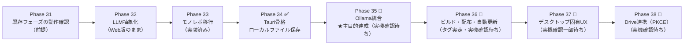

# IdeaMap デスクトップアプリ版 — 計画の入口

**このディレクトリは「Web版とデスクトップ版でコアを共通化しながら、ローカルLLM（Ollama）対応のデスクトップ版を作る」ための設計群です。**
作業を始める AI エージェント・開発者は、まず本ファイルを読んでから個別ドキュメントに進んでください。

最終更新: 2026-08-09

---

## 0. なぜデスクトップ版を作るのか

**ローカルLLM（Ollama, `http://localhost:11434`）を使いたいから**です。これが唯一かつ最大の動機です。

ブラウザから `localhost` の Ollama を叩く構成は CORS 設定（`OLLAMA_ORIGINS`）にユーザー側の環境依存が強く、GitHub Pages 配信の Web 版では安定して提供できません。Tauri の Rust プロセス経由（`tauri-plugin-http`）であればブラウザの CORS 制約を受けずにアクセスできます。

副次的な効果として、ローカルファイル中心の編集・OSキーチェーンによる APIキー保管・ウィンドウ状態の記憶などが手に入ります。

---

## 1. ドキュメント構成と読む順序

| # | ドキュメント | 扱う範囲 | 読むべき人 |
|---|---|---|---|
| 1 | [adr-001-framework-selection.md](adr-001-framework-selection.md) | **なぜ Tauri v2 なのか。** 候補比較（Tauri / Electron / Wails / Neutralino / PWA）、決定理由、懸念と対策、結論を覆す条件 | 技術選定の背景を知りたい人。実装時は読まなくてよい |
| 2 | [architecture.md](architecture.md) | **モノレポ構成とプラットフォーム抽象化。** 現状コードの依存棚卸し、`packages/*` `apps/*` の責務、Platform Adapter インタフェース定義、pnpm/TS/Vite/Tailwind のツールチェーン、10ステップの移行手順 | **全員必読。** 構成の土台 |
| 3 | [llm-abstraction.md](llm-abstraction.md) | **LLMプロバイダ抽象化。** `LLMProvider` インタフェース、`ClaudeProvider`/`OllamaProvider` 実装方針、構造化出力の差の吸収、`AIModel` 型の移行、設定UI、Ollama API 調査結果 | AI機能・Ollama連携を触る人 |
| 4 | [platform-integration.md](platform-integration.md) | **デスクトップ固有機能と配布。** ファイル管理モデル、OSキーチェーン、`tauri.conf.json`/capabilities の実例、GitHub Actions ビルド、自動更新、Windows 開発環境セットアップ | Tauri 側を触る人 |

既存の [../design.md](../design.md) / [../requirements.md](../requirements.md) / [../implementation-plan.md](../implementation-plan.md) が引き続き上位ドキュメントです。本ディレクトリはそれを補完する詳細設計であり、**置き換えるものではありません**。

---

## 2. 決定事項サマリ

| 項目 | 決定 | 根拠 |
|---|---|---|
| フレームワーク | **Tauri v2**（2026-07 時点の安定版 2.11.5） | `tauri-plugin-http` で Ollama へ CORS 制約なしにアクセスできる／既存 Vite+React 資産をほぼ無改修で流用できる／Electron 比でバンドル・メモリが小さい |
| リポジトリ構成 | **pnpm workspaces のモノレポ**。`packages/core` `packages/ui` `packages/platform` + `apps/web` `apps/desktop` | 依存の厳格さがそのまま「coreはUIに依存しない」というルールの強制装置になる |
| プラットフォーム差の吸収 | **Platform Adapter**（`StorageAdapter` / `FileAdapter` / `SecretAdapter` / `HttpAdapter` / `SystemAdapter`）を `setPlatform()` でシングルトン注入 | Zustand ストアが React ツリー外のプレーンモジュールとして設計済みのため、Context より自然 |
| LLM 抽象化 | `LLMProvider` インタフェース（`complete` / `completeJson` / `stream` / `listModels` / `capabilities`）に `ClaudeProvider` と `OllamaProvider` の2実装 | 構造化出力の方式差（Claude=プロンプト指示＋正規表現抽出 / Ollama=`format` にJSON Schema）を境界内に閉じ込める |
| デスクトップの保存先 | **ローカルファイル中心**（`.ideamap` 拡張子、実体はJSON）。ネイティブの開く/保存ダイアログ | Ollama利用者はローカル完結志向。`MapFile` 型は Web/Desktop 共通なのでファイル交換で相互運用できる |
| APIキーの保管 | デスクトップは **OSキーチェーン**（`keyring` crate）。マスターパスワード入力は不要になる | Stronghold 公式プラグインは非推奨化（v3で削除予定）のため不採用 |
| 配布 | GitHub Actions で Windows(MSI/NSIS)・macOS(dmg) をビルド → GitHub Releases → `tauri-plugin-updater` で自動更新。**当面はコード署名なし** | 個人開発。署名証明書は後から導入可能な移行パスを確保 |
| Web検索 | ollama.com の Web Search API（Bearer認証）。デスクトップ版のみ | ユーザー指定。ブラウザからは CORS で叩けず、`LLMProvider` の外側の独立機能として実装（§3.1-E） |
| デスクトップのネイティブUX | `.ideamap` 関連付け＋`single-instance`、D&D受け入れ、ウィンドウ状態記憶、外部変更検知。共有URLはJSON書き出しで代替 | 「ネイティブアプリらしさ」を実装。OSの「最近使った項目」統合は任意機能として見送り（§3.1-G） |
| デスクトップの Google Drive 連携 | **Phase 38 で対応**。ループバック（`http://127.0.0.1:<port>`）＋PKCE で認可し、リフレッシュトークンは OSキーチェーンへ。Drive はローカルファイルと並ぶ「もう一つの保存先」で、既定はローカルのまま | Web版で作ったマップをそのまま開ける導線が要る。GIS のポップアップは組み込みWebViewでは Google に拒否されるため方式ごと作り直した（§3.1-H） |

---

## 3. 横断的な裁定（ドキュメント間の矛盾の解決）

4本のドキュメントは並行して書かれたため、以下3点で結論が食い違っています。**本節の裁定が優先されます。**

### 3.1 デスクトップ版の Google Drive 連携 → **Phase 38 で対応済み（2026-08-09）**

- `architecture.md` §1.6・§3.4 は「Drive同期・GIS認証は Web専用として `apps/web` に閉じ込める」
- `platform-integration.md` §3.8 は「残す（オプションに格下げ、PKCEループバックで再実装）」

**裁定（Phase 38 で更新）:** デスクトップ版 v1（Phase 34〜37）は Drive 非対応でしたが、**Phase 38 で `platform-integration.md` §3.8 の方針を採用し、デスクトップ版も Drive に対応しました。**

`architecture.md` §1.6・§3.4 の「Drive同期は `apps/web` に閉じ込める」という記述は、**Drive の REST 呼び出しについてはもう有効ではありません。** `googleDriveService.ts` は `packages/core/src/services/driveService.ts` に移り、Web版・デスクトップ版の両方から使います。ただし **GIS 認証（`useGoogleAuth`）・共有URL・`MapListPanel`／`FileOpenDashboard` は引き続き `apps/web` 専用**で、この部分の記述は有効なままです。

認証方式は Web版とデスクトップ版で別物になります。Google は組み込み WebView からの認可リクエストを `disallowed_useragent` で拒否するため、GIS のポップアップはデスクトップ版では使えません。詳細は §3.1-H。

Phase 34〜37 の移行パス（JSON エクスポート → デスクトップ版で「開く」）も引き続き使えます。

### 3.1-H デスクトップ版 Drive 連携の設計判断（Phase 38 実施済み・2026-08-09）

`platform-integration.md` §3.8 の記述から意図的に変えた点と、実装時に確定した詳細です。**本節が優先されます。**

| # | 事項 | 判断 |
|---|---|---|
| 1 | `tauri-plugin-oauth` を使うか | **使わない。** 自前の Rust モジュール（`src-tauri/src/oauth.rs`）で `std::net::TcpListener` を使って実装した。必要なのは「1本の GET のクエリを読む」ことだけで、プラグインを足すと JS依存・Rust依存・`lib.rs` 登録・capability の4点を揃える保守コストが増える。自前コマンドなら capability の追加が不要（Tauri v2 でアプリ自身のコマンドは capability の管轄外）で、`keychain.rs` と同じ構成に揃う |
| 2 | PKCE の `code_challenge` の計算場所 | **Rust 側**（`sha2` + `base64` クレート）。`crypto.subtle` はセキュアコンテキストでしか使えず、Tauri の WebView でそれが保証されるかを実測していないため。`code_verifier` と `state` の生成は JS の `crypto.getRandomValues`（セキュアコンテキストの制約を受けない）で行い、verifier を Rust に渡してチャレンジだけ返してもらう |
| 3 | `access_type=offline` | **送らない。** Google 公式の「OAuth 2.0 for Mobile & Desktop Apps」は installed app について "refresh tokens are always returned for installed applications" と明記しており、認可リクエストのパラメータ表にも `access_type` が無い。Web server フロー向けの知識をそのまま持ち込まない |
| 4 | `client_secret` | **必須。** 当初は「PKCE 併用時は省略できる」（Google 公式のサンプルリクエストが送っていないため）と判断して任意扱いにしたが、**実機で 400 `invalid_request` "client_secret is missing." が返って覆った**（2026-08-09）。デスクトップアプリ種別のクライアントでは、公式ドキュメントのパラメータ表の注記（Android / iOS / Chrome には適用されない＝それ以外には適用される）どおり必要。`VITE_GOOGLE_DESKTOP_CLIENT_SECRET` に設定する。公開クライアントなのでこの値は機密ではなく、実際の防御は PKCE が担う（RFC 8252） |
| 5 | `redirect_uri` | `http://127.0.0.1:<port>`。`localhost` はファイアウォールで弾かれうると Google 公式が明記しているため使わない。ポートは毎回 OS から借りる（デスクトップアプリ種別は redirect URI の事前登録が不要） |
| 6 | メールアドレスの取得 | スコープに `openid email` を足し、**ID トークン（JWT）の `email` クレーム**から読む。Web版のように `userinfo` エンドポイントを叩かないので、HTTP 許可が1つ減り往復も1回減る。トークンエンドポイントから TLS で直接受け取ったものなので署名検証は不要 |
| 7 | トークンの保管 | リフレッシュトークンは **OSキーチェーン**（`SecretAdapter` の `googleRefreshToken` スロット）。アクセストークンはメモリのみ。メールアドレスは表示用なので `StorageAdapter`。Web版の `sessionStorage` 方式とは別物 |
| 8 | アップロードの組み立て | `FormData`/`Blob` をやめ、**`multipart/related` を文字列で手組み**する方式に変えた（`driveService.ts` の `buildMultipartBody`）。Tauri の plugin-http へ `FormData` を渡したときの挙動が未検証なのに対し、文字列ボディは Web版・デスクトップ版のどちらでも同じ経路で通るため。Web版の挙動も同時に変わる点に注意 |
| 9 | 保存先の判別 | `uiStore` に `currentFileOrigin`（`'cloud' \| 'local'`）を追加し、`currentFileId` と対で永続化する。`useAutoSave` はこれを見て `FileRef.origin` を決める。**デスクトップ版は1つの `FileAdapter` が両方を扱う複合アダプタ**になり、`FileAdapter.origin` の意味が「この Adapter が扱う唯一の保存先」から「保存先未指定のときの既定」に変わった |
| 10 | 既定の保存先 | **ローカルのまま。** `saveFileAs`（Ctrl+S での新規保存）はネイティブの保存ダイアログに進む。Drive へ上げるのは起動画面の「いま開いているマップをドライブに保存」、またはヘッダーの「接続済み」メニューの「このマップをドライブに保存」（#15）からの明示操作だけ。Ollama利用者のローカル完結志向（§2）を崩さないため |
| 11 | CSP | **変更しない。** Drive・トークンエンドポイントへの通信は `HttpAdapter` 経由＝Rust 側の plugin-http が発行するため WebView の CSP を通らない。Phase 35 の Anthropic API・ollama.com が `connect-src` に無いまま動いている実績がその裏付け。許可は capability（`google-drive.json`）側だけで足りる |
| 12 | 設定（`settings.json`）の Drive 同期 | **スコープ外。** デスクトップ版は APIキーを OSキーチェーンに置きマスターパスワードを持たない（§2）一方、Drive の `settings.json` はマスターパスワード暗号化が前提。`setAppSettingsSync()` はデスクトップ版では未注入のままにしてある。同期したくなったら `platform-integration.md` §4.4 の「同期のためだけの一時暗号化」から設計を起こす |
| 13 | 設定パネルの `DriveSyncSection` の表示条件 | `showCloudSync`（＝`cloudAuth` の有無）だけでは足りなくなったため、`SecretAdapter.isPassphraseFree` が false のときだけ出すよう条件を足した。**これが無いとデスクトップ版に「マスターパスワード & Drive同期」欄が現れ、押すと `setAppSettingsSync` 未注入で失敗する。** #12 と対で必要な変更 |
| 14 | ヘッダーの保存先表示 | `isSignedIn && currentFileId` という判定に `currentFileOrigin === 'cloud'` を足した。**デスクトップ版はサインイン中にローカルファイルを開いている状態がありえ、そのままだと「Drive」と誤表示する。** あわせて `restoreCurrentFileId()` は、origin が保存されていない（Phase 38 以前の）値を読んだとき `FileAdapter` の既定 origin に寄せる。当時は保存先がアプリごとに1つだけだったので、これが正しい復元になる |
| 15 | ヘッダーからの保存先切り替え（Phase 38 への追加実装・2026-08-09） | 起動画面の Drive 欄だけでは、編集中の画面から保存先切り替えの導線を見つけられなかった。`Header` に `onSaveToCloud` prop を追加し、「接続済み」メニューに「このマップをドライブに保存」を出す（ローカルのマップを開いているときだけ）。`DriveSection.tsx` にインラインで書かれていた保存処理は `apps/desktop/src/saveToDrive.ts` の `saveCurrentMapToDrive()` に切り出し、起動画面とヘッダーの両方から呼ぶ。あわせて `Header` に `showMapList` prop を追加し、`mapListSlot` を持たないデスクトップ版では「マップ一覧」メニュー項目とモバイル用アイコンボタンを隠すようにした（これまでは押しても何も起きない死んだ項目だった）。既定の保存先がローカルのままである点（#10）は変わらない |

### 3.1-B `LLMProvider` 実装時の4つの変更（Phase 32 実施済み・2026-08-05）

`llm-abstraction.md` の記述から意図的に変えた点が4つあります（中断時の `stream()` の返し方、`LLMError.name`、`maxContextTokens`、`toFriendlyAIError` の文言の置き場所）。**同ファイル §7 冒頭の表が優先されます。** そちらに理由とあわせて記載しています。

### 3.1-C モノレポ移行時の Adapter インタフェース変更（Phase 33 実施済み・2026-08-06）

`architecture.md` §3.1 の定義から意図的に変えた点が4つあります。**本節が優先されます。**

| 変更 | 内容 | 理由 |
|---|---|---|
| マップ内容の型 | `FileAdapter` の `openFile`/`saveFile`/`saveFileAs`/`saveLocalMirror` は `MapFile` ではなく `unknown` を受け渡す | `packages/platform` → `packages/core` の循環依存を避けるため。既存 `googleDriveService` も `saveMap(content: unknown)` で同じ扱いをしている |
| `SecretAdapter` の引数とメソッド | `getSecret(key, passphrase?)` / `setSecret(key, value, passphrase?)` に加え、`hasLegacySecret` / `getLegacySecret` / `clearLegacySecret` を追加 | Web のマスターパスワード方式（PBKDF2+AES-GCM）と Phase 27 以前のキー自動移行を維持するため。Desktop は passphrase を無視し、legacy 3メソッドは no-op / false / null を返す |
| `FileAdapter` の追加メソッド | `exportBlob(name, blob)` / `saveLocalMirror(content)` / `isRemoteReady` | `architecture.md` §1.2 は「`<a download>` は `saveFileAs` に置き換え可能」としていたが、`saveFileAs` はマップ本体の保存専用でシグネチャが合わないため、生成物（PNG/SVG/Markdown/JSON）の書き出しは別メソッドに分けた |
| `HttpAdapter.getFetch()` | `fetch` 互換関数そのものを返すメソッドを追加 | `@anthropic-ai/sdk` のように fetch 実装の差し替え口を持つライブラリへ渡すため。`ClaudeProvider` はこれで `packages/core` から `fetch` を直接呼ばずに済む |

あわせて、`settingsStore` の zustand `persist` は Phase 33 時点では **StorageAdapter に載せていません**。
非同期ストレージにするとハイドレーションが1マイクロタスク遅れ、初回描画がテーマ既定値で走ってちらつくためです。
Phase 33 の判定条件が「移行前と同じ動作」であることを優先し、Phase 34 で非同期ハイドレーション込みで対応します。

→ **Phase 34 で対応済み（2026-08-07）。** `storage` を StorageAdapter 経由の `createJSONStorage` にしたうえで `skipHydration: true` を付け、
`packages/core/src/stores/bootstrap.ts` の `restorePersistedState()` を各アプリの `main.tsx` が最初のレンダー前に await します。
自動ハイドレーションを止めて「復元してから描画する」順序に固定したので、ちらつきは起きません。

### 3.1-D Tauri 骨格実装時の設計判断（Phase 34 実施済み・2026-08-07）

`platform-integration.md` の記述から意図的に変えた点です。**本節が優先されます。**

| 変更 | 内容 | 理由 |
|---|---|---|
| capability の分割 | `main-window` / `file-access` / `ai-http` の3ファイル。`google-oauth` と `updater` は作らない | §3.1 の裁定で Drive はスコープ外、自動更新は Phase 36。`ollama-http` は Anthropic API と同じ「AIプロバイダへの通信」なので `ai-http` に統合した |
| ダイアログで選んだパスの `fs` 許可 | `fs:scope` はアプリ専用ディレクトリ（`$APPCONFIG` / `$APPLOCALDATA`）のみに絞り、ユーザーが選んだパスは dialog プラグインの実行時許可に任せる。それを次回起動へ引き継ぐため **`tauri-plugin-persisted-scope` を追加** | §8 #2 の「`$HOME/Documents/**` 等を明示追加」より攻撃面が狭い。「ユーザーが一度選んだファイルだけ」に限定できる |
| `FileAdapter.origin` の追加 | Adapter が扱う保存先の種別（`'cloud'` / `'local'`）を公開する | `useAutoSave` が `currentFileId` から `FileRef` を組み立てる際、`origin` を `'cloud'` 決め打ちにしていたため。3点（platform 型・web 実装・desktop 実装）を揃えて追加した |
| 自動保存の新規ファイル作成 | `AutoSaveOptions` に `createNewFileOnSave`（Web=true / Desktop=false）を追加。false のときデバウンス保存は `saveLocalMirror` だけで完了し、実ファイルの新規作成は明示保存（Ctrl+S・ヘッダークリック）に限る | §3.3 の「ファイル未確定時は `$APPLOCALDATA/autosave/` へ」を実現する具体手段。これが無いと3秒ごとに保存ダイアログが出る |
| キーチェーンの実装 | `keyring` crate v4 の `keyring::v1::Entry` を薄くラップした Tauri コマンド4本（`has_secret` / `get_secret` / `set_secret` / `clear_secret`）。コミュニティプラグインは使わない | §4.2 のコード例（keyring v3 相当）と API が変わっている。依存を増やさず自前ラッパーで足りる |
| ウィンドウの `dragDropEnabled` | `false` にする | §8 #4 の React Flow との競合が未検証。D&D を扱う Phase 37 で `true` にして検証する |
| クリップボード | `@tauri-apps/plugin-clipboard-manager` を使う（`navigator.clipboard` は使わない） | WebView のセキュアコンテキスト判定に依存しない |

### 3.1-E Ollama統合時の設計判断（Phase 35 実施済み・2026-08-07／Web検索は追加実装・2026-08-08）

`llm-abstraction.md` の記述から意図的に変えた点があります。**本節が優先されます。**

| 事項 | 判断 | 理由 |
|---|---|---|
| プラットフォーム判定 | `llm-abstraction.md` §6.1 の `isDesktopRuntime()`（`'__TAURI_INTERNALS__' in window`）は**使わない**。`HttpAdapter.canAccessLocalServers` を追加して Adapter 経由で判定する | §3.2 の裁定（`setPlatform()` 注入に統一）と整合させるため |
| `completeJson` の `temperature: 0` | **Ollama のみ**に適用し、Claude は SDK 既定のまま | `llm-abstraction.md` §4.2 は「両方」としていたが、Phase 35 の完了条件「Web版は Phase 34 以前と挙動が一致する」を優先した |
| Claude 向けプロンプト | スキーマのプロンプト埋め込みは Ollama のときだけ。Claude のプロンプト文字列は不変 | 同上 |
| `maxContextTokens` | `OllamaProvider.capabilities` は固定値 8192 のまま。実コンテキスト長は `ModelInfo.contextTokens` として `/api/tags` から取り、設定UIの表示に使う | `capabilities` はコンストラクタ時点で確定させたいが、実長はモデル選択後にしか分からないため |
| `think: false` | 全リクエストで送る（400 時フォールバックあり） | 思考モデル（qwen3.6 等）は思考トークンが `num_predict` を食い、`done_reason: 'length'` で出力が途中停止することを実測で確認したため |
| モデル一覧取得のタイムアウト | `AbortSignal.timeout()` は**使わない**。`AbortController` ＋ `setTimeout` にして、応答を読み切った時点で `clearTimeout` する | `tauri-plugin-http` は signal の abort でレスポンスボディを解放する（`fetch_cancel_body`）。読了後にタイマーが発火すると解放済みリソースを二重に解放し、`The resource id ... is invalid` の未処理例外がデスクトップ実機で出た |
| 分析3機能のキャンセルUI | `MapAnalysisPanel` に `AbortController` とキャンセルボタンを追加（`llm-abstraction.md` §7 の Phase 32 積み残しの解消） | ローカルLLMは応答が長くかかりうるため、Claude 前提だった頃より中断の必要性が高い |
| `opener` の URL スコープ | `main-window` capability の `opener:allow-open-url` を**スコープ付き**（`https://*` / `http://*`）に書き換えた | `opener:allow-open-url` はコマンドの許可だけで、URLスコープが空のままだと `openUrl()` が全て拒否される。Phase 34 では外部リンクを実際に押していなかったため気づけず、Web検索の出典リンクで発覚した |
| 外部リンクの実装 | 素の `<a target="_blank">` は使わず、`ExternalLink` コンポーネント（`SystemAdapter.openExternalUrl` 経由）に統一 | デスクトップ版の WebView では `target="_blank"` が無反応になる。Web版では `window.open` に解決されるので両対応できる |
| `ai-http` capability | `http://localhost:*/*` / `http://127.0.0.1:*/*` に拡大 | 接続先URL設定でポートを変更可能にするため。ホストは localhost 系に限定したままなので攻撃面は localhost 上のサービスに限られる |
| Phase 32 の移行用アダプタ削除 | `toLegacySuggestionParseError` / `toLegacyAnalysisParseError` を削除し `LLMError` に一本化。UI の生レスポンスコピーは `LLMError.rawResponse` から取る | `llm-abstraction.md` §7 Step 6 の予告どおり |
| バックエンド（Web検索） | ollama.com の Web Search API（ホスト型・Bearer認証） | ユーザー指定。ローカルの Ollama サーバーではなくクラウドAPIである点に注意 |
| プロバイダ非依存（Web検索） | LLM が Claude でも Ollama でも同じように使える。設定セクションも `OllamaSection` とは分けた | 検索は単なるHTTP APIでLLM選択と直交するため |
| Web版に出さない（Web検索） | `HttpAdapter.canAccessLocalServers` で判定 | ブラウザからは CORS 制約で ollama.com のAPIを直接叩けない |
| 取り込み量（Web検索） | 5件×600文字に切り詰め | 公式ドキュメントは「数千トークンになるのでコンテキスト長32K以上を推奨」とするが、ローカル小型モデルでも破綻しない量に抑えるため |
| トグルの粒度（Web検索） | 3機能（アイデア提案・AIチャット・マップ分析の全体分析タブ）で共有する1つのフラグ（`webSearchEnabled`）。設定として永続化 | 「AIに聞く前に選べる」という要求を満たしつつ、機能ごとに散らばらせない |
| APIキーの保管（Web検索） | OSキーチェーンの `webSearchApiKey` スロット（Claude APIキーとは別スロット） | 別サービスのキーなので混ぜない |
| タイムアウト（Web検索） | `AbortSignal.timeout()` は使わず `AbortController` + `clearTimeout` | 上表（モデル一覧取得のタイムアウト）と同じ理由（`plugin-http` のボディ二重解放。`docs/design.md` §9.1.2 参照） |
| 検索失敗時（Web検索） | 例外を握り潰さず AI 呼び出しごと失敗させ、`LLMError`（`auth`/`rateLimit`/`connection`）としてトーストに出す | ユーザーが明示的に検索をオンにしているので、黙って検索なしで実行すると気づけない |

検証した事実（Ollama 0.32.6 / Windows 11・2026-08-07）は `docs/implementation-plan.md` Phase 35 の「検証済み」「動作確認」を参照。Node から `HttpAdapter` をスタブした Provider 単体の確認に加え、`pnpm dev:desktop` で起動したデスクトップ実機に CDP でアタッチし、Rust 側 `plugin-http` 経由での Ollama 到達・AIチャット・マップ分析まで確認済み。残るのはアイデア提案／接続提案／クラスタ提案の実機確認と、日本語対応モデルの実用性評価（ユーザーの手動確認待ち）。

Web検索（ollama.com の Web Search API）の裏取り（エンドポイント・リクエスト/レスポンス形状・認証・401の実測）は `docs/desktop/llm-abstraction.md` §8.3 を参照。実装は完了しているが、デスクトップ実機でのWeb検索付きAI呼び出しの動作確認はユーザーの手動確認待ち（`docs/implementation-plan.md` Phase 35「追加実装」参照）。

### 3.1-F ビルド・配布実装時の設計判断（Phase 36 実施済み・2026-08-08）

`platform-integration.md` §6 の記述から意図的に変えた点があります。**本節が優先されます。**

| 事項 | 判断 | 理由 |
|---|---|---|
| バージョニング | ルート `package.json` の `version` を単一の真実にし、`scripts/sync-version.mjs` が `apps/web/package.json`・`apps/desktop/package.json`・`apps/desktop/src-tauri/tauri.conf.json`・`apps/desktop/src-tauri/Cargo.toml` の4ファイルへ配る。`--check` でCIがズレを検出する。初期バージョンは `0.1.0`。Web版とデスクトップ版で同じ番号を共有し、Gitタグは `desktop-v<version>` | 4ファイルを手で揃えると事故る。ルートを唯一の真実にすれば更新箇所は1つで済む |
| `tauri.conf.json` の `version` への相対パス指定（§5 #9） | 指定できることを実測で確認したが**採用しなかった**。`tauri.conf.json` の `version` は数値直書きのまま、同期スクリプトで配る方式を継続する | `apps/web/package.json` と `Cargo.toml` も揃える必要があり、どのみち同期スクリプトが要る。仕組みを二重に持たない判断 |
| 自動更新 | `tauri-plugin-updater` + `tauri-plugin-process`。JS依存（`@tauri-apps/plugin-updater` 2.10.1 / `@tauri-apps/plugin-process` 2.3.1）・Rust依存・`lib.rs` 登録・`capabilities/updater.json` の4点を揃えた。Rust依存は `[target.'cfg(not(any(target_os = "android", target_os = "ios")))'.dependencies]` に置き、`lib.rs` では `#[cfg(desktop)]` で登録する。エンドポイントは `https://github.com/mayamaura/ai-idea-map/releases/latest/download/latest.json`。更新チェックは起動5秒後の自動チェック（失敗・更新なしは無言）と、設定パネルの「更新を確認」ボタンによる手動チェック（結果を必ず返す）の2経路。更新適用前に `flushPendingSave()` でデバウンス待ちの自動保存を最大10秒待って確定させる | モバイルターゲット非対応のプラグインをビルド対象から切り離す。起動直後の重い処理（マップ復元・設定復元）とネットワークを取り合わない。手動操作は結果を隠さずユーザーに返す |
| updater の通信とCSP | 更新の取得は Rust 側（reqwest）が行うため WebView の CSP には関係しない。`tauri.conf.json` の `csp`/`devCsp` は変更していない | 誤って CSP を緩めないよう、対象外であることを明記しておく |
| `settingsExtraSections` スロット | `packages/ui` からプラットフォーム実装へ依存させないため、設定パネル末尾への差し込み口を `App` の props（`settingsExtraSections`）として追加した。`SettingsPanel` は `extraSections` として受け取る。既存の `mapListSlot`/`dashboardSlot` と同じ方針。デスクトップ版が `UpdaterSection`（バージョン表示＋「更新を確認」ボタン）を渡す | Web版・デスクトップ版で共通の `SettingsPanel` を保ちながら、プラットフォーム固有UIを注入できるようにする |

署名鍵（公開鍵は `tauri.conf.json` にコミット済み。秘密鍵とパスワードはリポジトリ外に保管）と無署名配布時の案内（README「初回起動時の警告について」節、SHA256チェックサム）の詳細は `docs/implementation-plan.md` Phase 36 を参照。GitHub Secrets への署名鍵登録・タグを打っての実ビルド・開発機以外での実機確認は未実施。

### 3.1-G デスクトップ固有UX実装時の設計判断（Phase 37 実施済み・2026-08-08）

`platform-integration.md` §3.4〜3.7 の記述から意図的に変えた点、または実装時に確定した詳細です。**本節が優先されます。**

| 事項 | 判断 | 理由 |
|---|---|---|
| `.ideamap` 関連付け + single-instance | `bundle.fileAssociations` で `.ideamap` を登録。`tauri-plugin-single-instance` を**最初に**登録し、2つ目のプロセスの引数を既存ウィンドウへ転送する。`launch.rs` が起動引数からマップファイルらしきパス（`.ideamap`/`.json`、`-` 始まりのオプションは除外、先頭の実行ファイル自身は飛ばす）を1つ選び `PendingLaunchFile` に保持し、フロントは `take_launch_file` コマンドで1回だけ取り出す。2つ目のインスタンスからは `ideamap://open-map-file` イベントで届く | macOS は起動引数ではなく `RunEvent::Opened` で届くため、`run(context)` ではなく `build()` + `run(closure)` に変更した（**macOS 実機は未検証**） |
| 起動引数のパスへの fs スコープ付与 | capabilities の `fs:scope` はアプリ専用ディレクトリのみで、ユーザーが選んだパスは dialog プラグインが実行時に許可を足す設計（Phase 34 の裁定）。**ダブルクリック起動は dialog を通らないため**、`launch.rs` の `grant_fs_access()` が `FsExt::try_fs_scope()` と `tauri::scope::Scopes` の両方に `allow_file()` を明示的に呼ぶ | これが無いと起動引数のファイルの読み込みが `forbidden path` で失敗する。**ドラッグ&ドロップは Tauri 本体が Drop イベント処理の中で同じ許可を出すため不要**（`tauri` 2.11.5 の `manager/webview.rs` の `DragDropEvent::Drop` 分岐で確認済み） |
| ドラッグ&ドロップ | `dragDropEnabled` を `false` → `true` に変更。`FileDropOverlay.tsx` が `onDragDropEvent` を購読し、ドラッグ中はオーバーレイを表示。`.ideamap`/`.json` 以外は案内トースト、未保存の変更があるときは確認ダイアログを挟む | React Flow のノード操作と競合しないことは実機確認済み（§5「Phase 37 で解消した項目」） |
| ウィンドウ状態の記憶 | `tauri-plugin-window-state` を追加。Rust側だけで完結し、JSから呼ばないため capability の追加は不要。`WindowEvent::CloseRequested`/`Moved`/`Resized` と `RunEvent::Exit` で保存する | `SystemAdapter.onBeforeExit` が `window.destroy()` で閉じる経路でも `RunEvent::Exit` は発火するため保存される |
| 外部ファイル変更の検知 | `externalChange.ts` が `onFocusChanged` を購読し、前面復帰時に `FileAdapter.getMetadata()` で mtime を取り直す。**初回は基準を記録するだけでダイアログを出さない**。基準は `max(記録した mtime, uiStore.lastSavedAt)` に `MTIME_TOLERANCE_MS`（2000ms）を足したもの。超えたときだけ確認ダイアログを出し、未保存の変更があれば `danger: true` にする。**「キャンセル」でも基準を進め、同じ内容を繰り返し尋ねない** | ファイルを開いた直後の誤検知を避け、自分の保存を外部変更と誤検知しないため。ファイルシステム監視（`notify` crate）は初期リリースにはオーバースペックとして見送った（`platform-integration.md` §3.7） |
| 共有URLの代替案内 | `ExportImportPanel` は `onGenerateShareUrl` が未指定でも「共有」タブ自体は隠さず、「JSONファイルとして共有」の案内（JSON書き出しボタン＋説明文）を表示する | これまでは未指定時にタブごと非表示にしていた。Web版（`onGenerateShareUrl` あり）の表示は変わらない |

### 3.2 プラットフォーム実装の切り替え方式 → **`setPlatform()` 注入に統一**

`platform-integration.md` §3.2 は「`import.meta.env` や `'__TAURI__' in window` 判定でエントリポイントを分ける」と書いていますが、これは `architecture.md` §3.5 で**明示的に却下された案C**です。

**裁定:** `architecture.md` §3.5 の**案A（`main.tsx` での `setPlatform()` シングルトン注入）**に統一します。`platform-integration.md` の Tauri API 呼び出しコード例は、`apps/desktop/src/platform/*.desktop.ts` の中身として読み替えてください。

### 3.3 `LLMProvider` の配置場所 → **モノレポ移行後は `packages/core/src/llm/`**

`llm-abstraction.md` はモノレポ移行前を前提に `src/services/llm/` と書いています。移行後の対応は以下です。

| `llm-abstraction.md` の記述 | モノレポ移行後の実体 |
|---|---|
| `src/services/llm/types.ts` | `packages/core/src/llm/types.ts` |
| `src/services/llm/claudeProvider.ts` | `packages/core/src/llm/claudeProvider.ts` |
| `src/services/llm/ollamaProvider.ts` | `packages/core/src/llm/ollamaProvider.ts` |
| `src/services/claudeService.ts` → `aiService.ts` | `packages/core/src/llm/aiService.ts` |
| `src/components/panels/*.tsx` | `packages/ui/src/components/panels/*.tsx` |
| `src/stores/settingsStore.ts` | `packages/core/src/stores/settingsStore.ts` |

**重要な制約:** `packages/core` は `fetch` を直接呼んではいけません（`architecture.md` §2.2）。`ClaudeProvider` / `OllamaProvider` の HTTP 呼び出しは必ず `getPlatform().http`（`HttpAdapter`）経由にします。Web版は `fetch` をそのまま、デスクトップ版は `@tauri-apps/plugin-http` を返す実装になり、**Ollama の CORS 問題はこの1箇所で解決します**。これが Adapter 設計上、最も重要な接続点です。

---

## 4. ロードマップ

詳細タスクは [../implementation-plan.md](../implementation-plan.md) の Phase 32 以降に記載しています。ここでは全体像と依存関係のみ示します。

| Phase | 内容 | 目安 | 主参照 | 完了時に得られるもの |
|---|---|---|---|---|
| 32 ✅ | LLMプロバイダ抽象化（Claude のみ、既存構成のまま） | 2日 | llm-abstraction §2〜3, §7 Step1-2 | Web版の挙動は不変。AbortSignal の実装漏れ解消とエラー分類の統一という副産物 |
| 33 🔨 | モノレポ移行（`packages/*` + `apps/web`） | 5日 | architecture §4〜5 Step0-7 | Web版が従来通り動き、コアが共通パッケージに分離された状態（実装済み・Drive 連携とデプロイの実機確認待ち） |
| 34 ✅ | Tauri デスクトップ版の骨格 | 5日 | platform-integration §5, §7 / architecture §5 Step8 | ウィンドウが起動し、マップ編集とローカルファイル保存ができる（Windows 実機で確認済み。設計からの差分は §3.1-D） |
| 35 🔨 | **Ollama 統合** | 4日 | llm-abstraction §3〜7 Step3-7 | **ローカルLLMでアイデア提案・チャットが動く＝当初目的の達成**（実装済み。デスクトップ実機でのAI機能5種の動作確認と日本語モデルの実用性確認が未了。差分は §3.1-E） |
| 36 🔨 | ビルド・配布・自動更新 | 3日 | platform-integration §6 | GitHub Actions によるビルド・下書きリリース公開・自動更新の仕組みは実装済み（`cargo check`・`pnpm typecheck`・`pnpm lint` 通過）。タグを打っての実ビルド・GitHub Secrets登録・開発機以外での実機確認が未了。差分は §3.1-F |
| 37 🔨 | デスクトップ固有UX（ファイル関連付け・D&D・ウィンドウ状態・外部変更検知・共有URL代替） | 3日 | platform-integration §3.4〜3.7 | 「ネイティブアプリらしさ」。実装済み・CDP+PowerShellでの実機確認済み。エクスプローラでの実ダブルクリック起動・実ドロップ操作・macOS実機は未確認。差分は §3.1-G |
| 38 🔨 | デスクトップ版 Google Drive 連携（ループバック + PKCE） | 3日 | platform-integration §3.8 | Web版とのクラウド同期。実装・型検査・Rustテスト（13件）は通過済み。**Google Cloud Console でのデスクトップ用クライアントID発行と、実機での認可〜Drive読み書きの確認が未了**。差分は §3.1-H |

### 4.1 順序についての判断

**Phase 32（LLM抽象化）を Phase 33（モノレポ移行）より先に置いています。** 理由は、LLM抽象化は既存の単一プロジェクト構成のままでも完結し、Web版に単独で価値（エラー処理の統一、`AbortSignal` の実装漏れ修正）を返すためです。移行時は `git mv` するだけで済みます。逆順でも成立しますが、大きな構造変更（Phase 33）の前に小さく安全な変更で足場を固める方を推奨します。

**Phase 31 の完了を Phase 33 の前提にしています。** モノレポ移行は「移行前後で挙動が変わっていないこと」を判定条件にするため、`🔨 実装済み（確認中）` のフェーズが残っていると、不具合が移行由来か元からかを切り分けられなくなります。

### 4.2 「最短でOllamaを試したい」場合の抜け道

Phase 33（モノレポ移行）を飛ばし、既存 `ideamap/` をそのまま Tauri で包んで Ollama を繋ぐことは技術的に可能で、体感2〜3日で動くものが得られます。ただし **Web版とデスクトップ版のコードが二重管理になり、本計画の目的（コア共通化）を失います**。試作としてブランチを切って捨てる前提なら有効ですが、それを本流にしないでください。

---

## 5. 未解決事項・要検証リスト

各ドキュメントで「未確認」と明記された事項の集約です。**該当フェーズの着手時に実機検証で解消し、結果を元のドキュメントに追記してください。**

| # | 事項 | 検証フェーズ | 出典 |
|---|---|---|---|
| 3 | `format` に JSON Schema オブジェクトを渡す機能の Ollama 最低バージョン。**Ollama 0.32.6 では動作を確認済み**（2026-08-07実測、`docs/implementation-plan.md` Phase 35「検証済み」参照）だが、「どのバージョンから」の下限は未確定のまま | 35 | llm-abstraction §8.2 |
| 8 | OSの「最近使った項目」「ジャンプリスト」統合が公式プラグインだけで完結するか | 37 | platform-integration §8 |
| 10 | macOS（WKWebView）でのレンダリング差異・日本語IME・描画性能。Windows では解消済みだが macOS 実機が未入手 | 36 | adr-001 §4 |
| 11 | `multipart/related` を文字列で手組みしたアップロードを Google Drive API が受け付けるか（`FormData` からの置き換え）。**Web版・デスクトップ版の両方の保存経路が変わるため、どちらでも実機確認が要る** | 38 | README §3.1-H #8 |
| 12 | Tauri の WebView で `crypto.subtle` が使えるか（＝セキュアコンテキストか）。使えるなら PKCE のチャレンジ計算を Rust に置く必要はなくなる。現状は Rust 側で計算して回避している | 38 | README §3.1-H #2 |
| 13 | OAuth 同意画面の公開ステータスが「Testing」の間はリフレッシュトークンが7日で失効する。実運用では「In production」への変更が必要 | 38 | README §3.1-H #7 |

#### Phase 34 で解消した項目（2026-08-07・Windows 11 実機）

| # | 結果 |
|---|---|
| 1 | **解消。** WebView2 151.0.4129.59 上で日本語IME入力（ノードのインライン編集・タイトル・AIチャット入力欄）に問題なし。**ADR-001 の結論を覆す条件には該当しなかった** |
| 2 | **解消。** 大規模マップでも React Flow の描画は実用範囲 |
| 6 | **解消。** ダイアログで選んだパスは `fs:scope` の外でも読み書きできた（`dialog` プラグインが実行時にスコープを付与する）。ダイアログを通していない `fs:scope` 外のパスは `forbidden path` で拒否されることも確認済みなので、スコープは意図どおり最小に効いている。`$HOME/Documents/**` の明示追加は不要 |

番号は元の表のものを維持している（#1・#2・#6 は上の表から削除済み）。

#### Phase 35 で解消した項目（2026-08-07・Ollama 0.32.6 / Windows 11）

| # | 結果 |
|---|---|
| 4 | **解消。** 実装が `tauri-plugin-http`（Rust側発行）経由に統一されたため、そもそもブラウザの CORS 制約を受けない。`OLLAMA_ORIGINS` を触らないデフォルト状態のまま、デスクトップ実機（`pnpm dev:desktop`・Vite オリジン `http://localhost:5174`）から `/api/tags` `/api/ps` `/api/chat` すべてに到達できることを CDP 経由で確認した |
| 5 | **解消。** `/api/tags` の `details.context_length` が実コンテキスト長を返す（Ollama 0.32系以降が対応）。モデルファミリーごとに `/api/show` の `model_info` フィールド名を調べる必要がなくなった。取得値は `ModelInfo.contextTokens` として設定UIの表示に使う（`docs/design.md` §9.1.2） |

番号は元の表のものを維持している（#4・#5 は上の表から削除済み）。

#### Phase 36 で解消した項目（2026-08-08）

| # | 結果 |
|---|---|
| 9 | **解消。** `tauri.conf.json` の `version` に `package.json` への相対パス文字列（`"../../../package.json"`）を指定できることを実測で確認した。`cargo check`（tauri-build）と `pnpm --filter @ideamap/desktop exec tauri inspect wix-upgrade-code`（tauri CLI）の両方が成功し、存在しないパス（`"../../nonexistent-package.json"`）を指定すると両方とも「`tauri.conf.json > version` must be a semver string」で失敗することから、パスとして解決されていることを確認した。**両者とも `src-tauri` を基準に解決する。** ただし本プロジェクトでは `apps/web/package.json` と `Cargo.toml` も揃える必要があり同期スクリプトがどのみち要るため、仕組みを二重に持たない判断で `tauri.conf.json` も数値で持つ方式を採用した（採用理由の詳細は §3.1-F） |

番号は元の表のものを維持している（#9 は上の表から削除済み）。

#### Phase 37 で解消した項目（2026-08-08）

| # | 結果 |
|---|---|
| 7 | **解消。** `dragDropEnabled: true` の状態で、デスクトップ実機（`pnpm dev:desktop` + CDP アタッチ）にて ①React Flow のノードをポインタ操作でドラッグして 140,84 px 移動できること ②WebView 内の HTML5 `dragstart` が発火すること（`PresentationOrderPanel` の並べ替えが依存している）を確認した。React Flow のノード操作は HTML5 drag&drop ではなくポインタイベント（d3-drag）で実装されているため競合しない |

番号は元の表のものを維持している（#7 は上の表から削除済み）。

---

## 6. AIエージェントへの作業開始手順

1. 本ファイル（README.md）を最後まで読む。特に **§3 の裁定**は個別ドキュメントの記述より優先する。
2. [../implementation-plan.md](../implementation-plan.md) で、着手するフェーズのタスクと完了判定条件を確認する。
3. そのフェーズの「主参照」ドキュメントを読む。
4. 実装する。**各ドキュメントの完了判定条件を満たさないまま次のステップに進まない。**
5. コード変更と同じ（または直後の）コミットで、[../design.md](../design.md) / [../requirements.md](../requirements.md) / [../implementation-plan.md](../implementation-plan.md) を更新する（ルート `CLAUDE.md` の規約）。
6. 本ディレクトリの設計そのものを変更した場合（Adapter インタフェースの変更、依存方向の変更、フレームワークの再選定など）は、該当ドキュメントと本 README の §2・§3 を更新する。
7. §5 の未検証事項を実機で確認したら、結果を出典ドキュメントに追記して表から消す。

### やってはいけないこと

- `packages/core` / `packages/ui` から `localStorage`・`fetch`・`window.google`・`<a download>` を直接呼ぶ（必ず `getPlatform()` 経由）
- Adapter のメソッド追加時に、`packages/platform` の型・`apps/web` 実装・`apps/desktop` 実装のどれかを欠いたままコミットする
- Web版とデスクトップ版で同じロジックを別々に書く（それが起きたら `packages/core` に上げる合図）
- 移行中に「ファイル移動」と「ロジック変更」を同じコミットに混ぜる（差分レビューが不可能になる）
