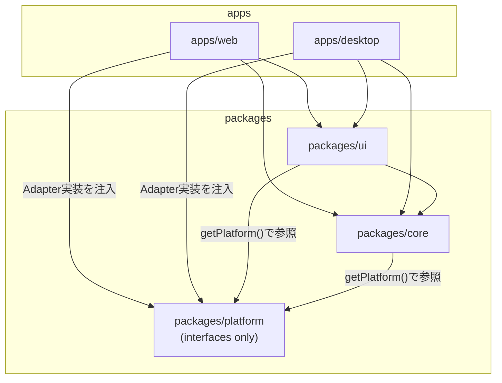

# IdeaMap デスクトップ対応 モノレポ・プラットフォーム抽象化 設計書

**作成日**: 2026-08-05
**バージョン**: 1.0
**対象**: Web版（既存 `ideamap/`）とデスクトップ版（Tauri v2、新規）のコード共通化

> **先に [README.md](README.md) を読んでください。** ドキュメント間で結論が食い違う箇所は README §3 の裁定が優先されます。本書に関係する裁定は次の2点です。
> - **Phase 38（2026-08-09）でデスクトップ版も Google Drive に対応しました。** 本書 §1.6・§3.4 の「`googleDriveService.ts` を Web専用として `apps/web` に閉じ込める」という記述は**もう有効ではありません**（実体は `packages/core/src/services/driveService.ts` に移り、`HttpAdapter` 経由で両アプリから使います）。ただし GIS認証（`useGoogleAuth`）・共有URL・`MapListPanel`／`FileOpenDashboard` を `apps/web` 専用とする方針は有効なままです。デスクトップ版の認証はループバック＋PKCE の別実装で、§8 の「Google認証はAdapterで吸収しない」という判断は変わっていません。詳細は README §3.1 と §3.1-H。
> - `LLMProvider`（`ClaudeProvider`/`OllamaProvider`）は `packages/core/src/llm/` に置き、HTTP 呼び出しは必ず `getPlatform().http`（`HttpAdapter`）経由にします。**Ollama の CORS 問題はこの1箇所で解決します。** 詳細は [llm-abstraction.md](llm-abstraction.md)。

---

## 0. 目的とスコープ

現在の IdeaMap は `ideamap/` 配下の単一 Vite プロジェクトとして実装されており、状態管理（Zustand）・永続化（`localStorage` / Google Drive）・認証（Google Identity Services）・エクスポート（`<a>` タグダウンロード）がすべてブラウザ API に直結している。

デスクトップ版は Tauri v2 上に同じ React フロントエンドを載せ、**ローカル LLM（Ollama）利用**を主目的とする。ブラウザ専用 API（`localStorage`、Google OAuth のポップアップフロー、`<a>` ダウンロード等）はそのままでは Tauri のネイティブウィンドウ上で意味を持たない、または動作しない（後述）ため、プラットフォーム差分を型で吸収する **Platform Adapter** を導入し、ロジック・UIをモノレポ構成で共通化する。

本書は以下を定義する。

1. 現状のプラットフォーム依存の棚卸し
2. 目標のモノレポ構成
3. Platform Adapter インタフェース定義
4. ツールチェーン構成
5. 段階的移行手順
6. AIエージェント向けの開発ルール案

LLM（Anthropic API / Ollama）自体の抽象化の詳細設計は本書のスコープ外とし、`docs/desktop/llm-abstraction.md`（別途作成予定）で扱う。本書では `HttpAdapter` としてインタフェースの境界のみを定義する。

---

## 1. 現状のプラットフォーム依存の棚卸し

実装済みコード（`ideamap/src/**`）を読み、ファイル単位でプラットフォーム依存度を分類した。分類基準は次の3段階。

| 分類 | 意味 |
|---|---|
| **Web専用** | ブラウザ固有の挙動・UXそのものが目的で、デスクトップでは別実装に置き換える（共有できない） |
| **共通化可能** | DOM/OS固有APIを呼んでいない、または呼んでいても Tauri の WebView 上でも同一に動作する（純粋ロジック・React部分） |
| **要抽象化** | ロジック自体は共通だが、内部で呼んでいる永続化・認証・ファイルI/O等のAPIをAdapter経由に差し替える必要がある |

### 1.1 ストア・型

| ファイル | 分類 | 該当API・依存 | 備考 |
|---|---|---|---|
| `src/types/index.ts` | 共通化可能 | なし（純粋な型定義） | そのまま `packages/core` へ |
| `src/stores/mapStore.ts`（1135行） | 共通化可能 | なし。`zustand` と `@xyflow/react` の型のみに依存。`localStorage` 等は一切使用していない | Undo/Redo・ノード/エッジ操作は完全にプラットフォーム非依存。`useUIStore.getState()` を直接呼ぶ密結合があるが、`uiStore` も共通化されるため問題ない |
| `src/stores/uiStore.ts` | 要抽象化 | `src/services/storageService.ts` の `saveDriveFileId` / `loadDriveFileId`（内部で `localStorage.setItem/getItem/removeItem`） | `setCurrentFileId` の副作用1箇所のみが依存。`StorageAdapter` 経由に差し替えれば残りは共通化可能 |
| `src/stores/settingsStore.ts` | 要抽象化 | `zustand/middleware` の `persist`（デフォルトで `localStorage` を使用）／`src/utils/encryption.ts`（`localStorage` 直結のAPIキー保管）／`src/services/googleDriveService.ts`（Web専用の設定同期） | 3種類の異なる永続化がひとつのストアに同居している。`persist` のストレージエンジン・APIキー保管・Drive同期をそれぞれ別のAdapterに切り出す必要がある |

### 1.2 サービス層

| ファイル | 分類 | 該当API・依存 | 備考 |
|---|---|---|---|
| `src/services/storageService.ts` | 要抽象化 | `localStorage.getItem/setItem/removeItem`（`CURRENT_MAP_KEY`, `DRIVE_FILE_ID_KEY`, `RECENT_MAPS_KEY`） | 完全に `localStorage` のラッパー。`StorageAdapter` そのものに相当する |
| `src/services/googleDriveService.ts` | Web専用 | `fetch` による Google Drive REST API 呼び出し、`FormData`/`Blob` によるマルチパートアップロード | ロジックは汎用的な HTTP 呼び出しだが、「Google Drive をマップの主保存先にする」という機能自体がWeb版の設計判断。デスクトップ版はローカルFSが主保存先になるため、実装ごと `apps/web` に閉じ込める（Adapterの一実装として） |
| `src/services/exportService.ts` | 要抽象化／Web専用混在 | ①`downloadDataUrl`/`downloadText`: `document.createElement('a')` + `link.click()` によるダウンロード ②`generateShareUrl`/`parseMapFromUrl`/`clearMapFromUrl`: `window.location.href`, `URLSearchParams`, `window.history.replaceState` ③`toPng`/`toSvg`（html-to-image）: `document.querySelector('.react-flow__viewport')` | ①は `FileAdapter.saveFileAs` に置き換え可能（要抽象化）。②の共有URL機能はブラウザのURLバー前提の機能でありデスクトップに対応する概念がないため **Web専用**として残す。③はReact Flowのビューポート要素をキャプチャするだけで、TauriのWebViewでも同一に動作するため**共通化可能**（DOM操作だが両プラットフォームで同一に機能する） |
| `src/utils/encryption.ts` | 要抽象化 | ①PBKDF2+AES-GCM の暗号化/復号関数（`crypto.subtle`） ②`localStorage.getItem/setItem/removeItem`（`ideamap-apikey-mp`, 旧形式 `ideamap-apikey-enc`/`ideamap-salt`） | `crypto.subtle`（WebCrypto）はTauriのWebViewでも利用可能なため①はロジックとして共通化できる。②の保存先は `SecretAdapter` に切り出す。デスクトップではOSキーチェーンを使うため、そもそも自前のパスワード暗号化が不要になる可能性がある（1.4節参照） |

### 1.3 Google認証・自動保存

| ファイル | 分類 | 該当API・依存 | 備考 |
|---|---|---|---|
| `src/hooks/useGoogleAuth.ts` | Web専用 | `window.google.accounts.oauth2`（Google Identity Services）、`sessionStorage`（アクセストークン）、`localStorage`（`googleAuthRequested`, `googleUserEmail`）、`document.addEventListener('visibilitychange', ...)` | GIS のトークンクライアントはブラウザのポップアップ機構に依存する。**Googleは組み込みWebView内でのOAuthを `disallowed_useragent` エラーでブロックするポリシーを持っており、TauriのWebViewでは現行方式のままでは動作しない**（1.4節で詳述）。丸ごと `apps/web` に閉じ込める |
| `src/hooks/useAutoSave.ts` | 要抽象化 | `saveMapLocally`（`storageService.ts` 経由で `localStorage`）、`saveMap`/`fetchMapAppProperties`/`loadMap`（`googleDriveService.ts`） | 「変更をデバウンスして保存する」というオーケストレーションロジック自体は共通化できる。保存先の実体（ローカル保存／Drive保存／衝突検出）を `FileAdapter` に委譲すれば、デスクトップでは同じフックがローカルファイル保存に差し替わる |

### 1.4 アプリ本体・その他コンポーネント

| ファイル | 分類 | 該当API・依存 | 備考 |
|---|---|---|---|
| `src/App.tsx` | 要抽象化 | `localStorage.getItem/setItem('ideamap-welcomed')`、`window.addEventListener('beforeunload', ...)`＋`e.preventDefault()`/`e.returnValue` | Welcome表示フラグは `StorageAdapter`。終了前確認は `beforeunload` がネイティブウィンドウの閉じる操作を必ずしも捕捉しないため（Tauriはウィンドウの `close-requested` イベントで捕捉する）、`SystemAdapter.onBeforeExit` に抽象化する |
| `src/components/common/Header.tsx` / `src/components/toolbar/Toolbar.tsx` | 共通化可能 | `document.addEventListener('mousedown', ...)`（外側クリック検出のみ） | 一般的なDOMイベントで両プラットフォームのWebViewで同一に動作する |
| `src/components/panels/ExportImportPanel.tsx` / `src/components/panels/MapAnalysisPanel.tsx` | 要抽象化 | `navigator.clipboard.writeText(...)` | `SystemAdapter.copyToClipboard` に置き換え可能。呼び出し元のロジックは共通化できる |
| `src/components/screens/FileOpenDashboard.tsx` | Web専用 | `localStorage.getItem('googleUserEmail')`（表示用） | Google認証状態の表示。`useGoogleAuth` と同様に `apps/web` 専用 |
| `src/components/canvas/ContextMenu.tsx`（CLAUDE.md記載） | 共通化可能 | `createPortal(content, document.body)` | Reactの標準機能であり両WebViewで同一に動作 |

### 1.5 設定ファイル

| ファイル | 分類 | 備考 |
|---|---|---|
| `ideamap/package.json` | — | 依存は React 19 / Vite 8 / TS 6 / Tailwind 3 / Zustand 5 / `@xyflow/react` 12 / `@anthropic-ai/sdk` / `dompurify` / `html-to-image` / `@dagrejs/dagre` / `uuid`。`@anthropic-ai/sdk` はブラウザから直接APIを叩く構成であり、デスクトップでは `HttpAdapter` 経由の到達性に左右される（詳細は `llm-abstraction.md`） |
| `ideamap/vite.config.ts` | Web専用 | `base: '/ai-idea-map/'`（GitHub Pages配信用のベースパス）。デスクトップビルドでは不要 |
| `ideamap/tailwind.config.js` | 共通化可能 | `content` パス以外はデザイントークンであり共有可能 |
| `ideamap/tsconfig*.json` | 共通化可能 | 既に `tsconfig.json` が `tsconfig.app.json`/`tsconfig.node.json` への project references 構成になっており、モノレポのproject references拡張と親和性が高い |

### 1.6 まとめ

- **完全に共通化可能**なのは `types/index.ts` と `mapStore.ts`（＝アプリの中核ロジック）で、これは棚卸しの中で最も重要な発見である。Undo/Redo・グループ化・整列など複雑なロジックがプラットフォームAPIに一切触れていないため、無改修で `packages/core` へ移動できる。
- **要抽象化**の対象は「どこに・どう保存するか」（`StorageAdapter`/`FileAdapter`/`SecretAdapter`）と「クリップボード・終了確認」（`SystemAdapter`）に整理できる。
- **Web専用**として残るのは Google Drive 同期・GIS認証・共有URL の3機能で、これらは製品機能としてWeb版にのみ存在し続けてよい（デスクトップの主保存先はローカルFS）。

---

## 2. 目標のモノレポ構成

### 2.1 ディレクトリツリー

```
ai-idea-map/
├── CLAUDE.md
├── docs/
│   ├── design.md
│   ├── requirements.md
│   ├── implementation-plan.md
│   └── desktop/
│       ├── architecture.md          # 本書
│       └── llm-abstraction.md       # LLM抽象化の詳細（別途作成）
├── package.json                     # workspaceルート
├── pnpm-workspace.yaml
├── tsconfig.json                    # project references の起点
├── tsconfig.base.json                # 共有 compilerOptions
├── eslint.config.js                  # 共有ESLint flat config
│
├── packages/
│   ├── core/                        # 型・ストア・純粋ロジック・レイアウト計算
│   │   ├── package.json
│   │   ├── tsconfig.json
│   │   └── src/
│   │       ├── types/index.ts
│   │       ├── stores/
│   │       │   ├── mapStore.ts
│   │       │   ├── uiStore.ts
│   │       │   └── settingsStore.ts
│   │       ├── layout/mapLayout.ts
│   │       ├── crypto/passwordCrypto.ts   # WebCrypto暗号化ロジック（純粋関数）
│   │       └── index.ts
│   │
│   ├── ui/                          # Reactコンポーネント・hooks
│   │   ├── package.json
│   │   ├── tsconfig.json
│   │   ├── tailwind-preset.js       # デザイントークン共有用プリセット
│   │   └── src/
│   │       ├── components/
│   │       │   ├── canvas/
│   │       │   ├── panels/
│   │       │   ├── toolbar/
│   │       │   ├── screens/
│   │       │   └── common/
│   │       ├── hooks/
│   │       │   ├── useAutoSave.ts
│   │       │   └── useKeyboardShortcuts.ts
│   │       └── index.ts
│   │
│   └── platform/                    # Platform Adapter インタフェース定義のみ
│       ├── package.json
│       ├── tsconfig.json
│       └── src/
│           ├── types.ts             # StorageAdapter / FileAdapter / SecretAdapter / HttpAdapter / SystemAdapter
│           ├── registry.ts          # setPlatform / getPlatform
│           └── index.ts
│
└── apps/
    ├── web/                         # 既存 ideamap/ を移行
    │   ├── package.json
    │   ├── vite.config.ts
    │   ├── tailwind.config.js
    │   ├── tsconfig.json
    │   ├── index.html
    │   └── src/
    │       ├── main.tsx             # setPlatform(webPlatform) を呼んでから <App/> をマウント
    │       ├── platform/            # Web実装
    │       │   ├── storage.web.ts
    │       │   ├── file.web.ts      # googleDriveService・ダウンロード処理はここに集約
    │       │   ├── secret.web.ts    # encryption.ts の永続化部分
    │       │   ├── http.web.ts
    │       │   └── system.web.ts
    │       ├── hooks/useGoogleAuth.ts   # Web専用のまま
    │       └── components/screens/FileOpenDashboard.tsx  # Google連携UIを含むためWeb専用
    │
    └── desktop/                     # Tauri v2 新規プロジェクト
        ├── package.json
        ├── vite.config.ts
        ├── tailwind.config.js
        ├── tsconfig.json
        ├── index.html
        ├── src-tauri/
        │   ├── Cargo.toml
        │   ├── tauri.conf.json
        │   └── src/main.rs
        └── src/
            ├── main.tsx              # setPlatform(desktopPlatform) を呼んでから <App/> をマウント
            └── platform/             # Desktop実装（Tauriプラグイン呼び出し）
                ├── storage.desktop.ts
                ├── file.desktop.ts
                ├── secret.desktop.ts
                ├── http.desktop.ts
                └── system.desktop.ts
```

### 2.2 各パッケージの責務と禁止事項

| パッケージ | 責務 | 入れてはいけないもの |
|---|---|---|
| `packages/core` | 型定義、Zustandストア（`mapStore`/`uiStore`/`settingsStore`）、レイアウト計算、暗号化アルゴリズムなどの純粋ロジック | Reactコンポーネント（`.tsx` のUI）、`localStorage`/`window`/`document`/`fetch` の直接呼び出し、`apps/*` や `packages/ui` への依存 |
| `packages/ui` | Reactコンポーネント、UI用hooks（`useAutoSave` 等のオーケストレーションフックもここ。DOM操作を伴うが両WebViewで共通のもの） | Google Drive / GIS 認証など特定プラットフォームの外部サービスへの直接依存、`apps/*` への依存、`localStorage` 等の直接呼び出し（必ず `getPlatform()` 経由） |
| `packages/platform` | Adapterインタフェースの型定義と、注入されたAdapterを取得するための最小限のレジストリ（`setPlatform`/`getPlatform`） | Adapterの実装そのもの、`@tauri-apps/*` や `window.google` 等プラットフォーム固有SDKへの依存。**型とレジストリのみ**に保つ |
| `apps/web` | `packages/ui` を土台にした薄いシェル。Web版Adapter実装、Google Drive同期、GIS認証、Viteのビルド設定 | `packages/core`/`packages/ui` に置くべき汎用ロジックの重複実装 |
| `apps/desktop` | Tauriシェル。Desktop版Adapter実装（OSキーチェーン・ローカルFS・ネイティブダイアログ）、Tauri設定 | Web専用機能（Drive同期・GIS認証・共有URL）の持ち込み |

### 2.3 依存方向



**循環禁止ルール**

1. 矢印は常に「利用する側 → 利用される側」の一方向。`packages/core` が `packages/ui` を、`packages/ui` が `apps/*` を import することは**禁止**。
2. `packages/platform` は最終ノード（型定義のみ）であり、他のどのパッケージにも依存しない。Adapterの**実装**は `apps/web`・`apps/desktop` にのみ存在し、`packages/platform` は関与しない。
3. `packages/core` と `packages/ui` の間で相互 import が発生した場合は設計ミス（ロジックがReactコンポーネントに漏れている、またはUI専用の状態がストアに紛れ込んでいる）。
4. 依存方向の逸脱は `eslint-plugin-import` の `import/no-restricted-paths` でビルド時に機械的に検出する（4.4節）。

---

## 3. Platform Adapter インタフェース定義

> **Phase 33（2026-08-06）実施時に4点変更しています。** 実体は `packages/platform/src/types.ts` を参照し、
> 変更理由は [README.md](README.md) §3.1-C を読んでください。本節の以下の記述は当初案です。


### 3.1 型定義本体（`packages/platform/src/types.ts`）

```typescript
import type { MapFile } from '@ideamap/core'

// ---- StorageAdapter: 設定・最近使ったマップ等のKey-Value永続化 ----

export interface StorageAdapter {
  getItem(key: string): Promise<string | null>
  setItem(key: string, value: string): Promise<void>
  removeItem(key: string): Promise<void>
}

// ---- FileAdapter: マップファイルの読み書き ----

export interface FileRef {
  /** Web = Google Drive の fileId、Desktop = ローカルの絶対パス */
  id: string
  name: string
  origin: 'cloud' | 'local'
  updatedAt: string
}

export interface RecentFileEntry {
  ref: FileRef
  title: string
}

export interface FileAdapter {
  /** 最近開いたマップの一覧（ダッシュボード表示用） */
  listRecent(): Promise<RecentFileEntry[]>
  /** ref省略時はファイル選択ダイアログ（Desktop）/ マップ一覧（Web）を開く。キャンセル時は null */
  openFile(ref?: FileRef): Promise<{ ref: FileRef; content: MapFile } | null>
  /** 既存ファイルへの上書き保存 */
  saveFile(ref: FileRef, content: MapFile): Promise<FileRef>
  /** 新規保存（Web=Driveへ新規作成 or ブラウザダウンロード、Desktop=名前を付けて保存ダイアログ）。キャンセル時は null */
  saveFileAs(content: MapFile, suggestedName: string): Promise<FileRef | null>
  deleteFile(ref: FileRef): Promise<void>
  /**
   * 衝突検出用の軽量メタデータ取得。
   * Web = Drive の appProperties.mapId、Desktop = ファイルの mtime とファイル内 mapId
   */
  getMetadata(ref: FileRef): Promise<{ mapId: string | null; updatedAt: string } | null>
}

// ---- SecretAdapter: APIキー等の秘密情報 ----

export interface SecretAdapter {
  hasSecret(key: string): Promise<boolean>
  getSecret(key: string): Promise<string | null>
  setSecret(key: string, value: string): Promise<void>
  clearSecret(key: string): Promise<void>
  /**
   * true の場合、呼び出し元はマスターパスワードのUIを表示しない。
   * Web = false（WebCrypto暗号化にパスワードが必須）、Desktop = true（OSキーチェーンがOSログインで既に保護されている）
   */
  readonly isPassphraseFree: boolean
}

// ---- HttpAdapter: ローカルHTTPアクセス可否の差を吸収 ----
// LLM呼び出し自体の抽象化（プロンプト整形・ストリーミング等）は
// docs/desktop/llm-abstraction.md で扱う。ここでは「誰が実際にfetchするか」の境界のみ定義する。

export interface HttpAdapter {
  /**
   * Web = ブラウザの fetch（CORS制約を受ける）
   * Desktop = Tauriの http プラグイン経由（Rust側から発行するためCORSの制約を受けない）
   */
  request(input: string, init?: RequestInit): Promise<Response>
}

// ---- SystemAdapter: クリップボード・外部URL・終了前確認・通知 ----

export interface SystemAdapter {
  copyToClipboard(text: string): Promise<void>
  openExternalUrl(url: string): Promise<void>
  /**
   * 終了前確認ハンドラを登録する。ハンドラが false を返すと終了をキャンセルする。
   * Web = beforeunload、Desktop = ウィンドウの close-requested イベント。
   * 戻り値は登録解除用の関数。
   */
  onBeforeExit(handler: () => boolean | Promise<boolean>): () => void
  notify(message: string, type: 'info' | 'success' | 'error'): void
}

// ---- 集約型とレジストリで使うプラットフォーム全体 ----

export interface Platform {
  storage: StorageAdapter
  file: FileAdapter
  secret: SecretAdapter
  http: HttpAdapter
  system: SystemAdapter
}
```

### 3.2 レジストリ（`packages/platform/src/registry.ts`）

```typescript
import type { Platform } from './types'

let currentPlatform: Platform | null = null

/** 各アプリの main.tsx で、Reactのレンダー開始前に1度だけ呼び出す */
export function setPlatform(platform: Platform): void {
  currentPlatform = platform
}

export function getPlatform(): Platform {
  if (!currentPlatform) {
    throw new Error(
      'Platform が未初期化です。apps/*/src/main.tsx で setPlatform() を呼び出してください'
    )
  }
  return currentPlatform
}
```

### 3.3 Web実装 / Desktop実装 対応表

> **Phase 34 実装時の差分（2026-08-07）。** Desktop 実装で本表と変えた点が3つあります。
> `SecretAdapter` は `@tauri-apps/plugin-keyring` ではなく **`keyring` crate を薄くラップした自前の Tauri コマンド4本**（`apps/desktop/src-tauri/src/keychain.rs`）。
> `SystemAdapter.openExternalUrl` は `@tauri-apps/plugin-shell` ではなく **`@tauri-apps/plugin-opener`**（Tauri v2 で `shell` の `open` が `opener` へ分離されたため）。
> `FileAdapter.listRecent` は OS の recent documents ではなく **`@tauri-apps/plugin-store` に自前で持つパスの一覧**（OS統合は Phase 37 で検証）。
> あわせて `origin` プロパティが追加されています（README §3.1-D）。

#### StorageAdapter

| メソッド | Web実装（`apps/web/src/platform/storage.web.ts`） | Desktop実装（`apps/desktop/src/platform/storage.desktop.ts`） |
|---|---|---|
| `getItem`/`setItem`/`removeItem` | `localStorage` をそのままラップ（既存 `storageService.ts` の関数群を移設） | `@tauri-apps/plugin-store` で JSON ストアファイルを読み書き |

#### FileAdapter

| メソッド | Web実装 | Desktop実装 |
|---|---|---|
| `listRecent` | `loadRecentMaps()`（`localStorage`）＋サインイン時は `listMaps()`（Drive API） | ローカルの「最近使ったファイル」一覧（Tauriの `recent_documents` 相当、または自前でJSON管理） |
| `openFile` | Drive の `loadMap()`、未サインイン時は `<input type=file>` または既存 `importFromJson` | `@tauri-apps/plugin-dialog` の `open()` でネイティブファイル選択ダイアログ → `@tauri-apps/plugin-fs` で読み込み |
| `saveFile` | サインイン時: `saveMap()`（Drive PATCH）。未サインイン時: `saveMapLocally()`（`localStorage`） | 既知のパスへ `writeTextFile()`（`@tauri-apps/plugin-fs`） |
| `saveFileAs` | Drive新規作成（`saveMap()`）、またはブラウザダウンロード（既存 `downloadText`） | `@tauri-apps/plugin-dialog` の `save()` でパス選択 → `writeTextFile()` |
| `getMetadata` | `fetchMapAppProperties()`（Drive） | ファイルの `mtime` とファイル内容の `mapId` を読み出して比較 |

#### SecretAdapter

| メソッド | Web実装 | Desktop実装 |
|---|---|---|
| `hasSecret`/`getSecret`/`setSecret`/`clearSecret` | 既存 `encryption.ts` のマスターパスワード方式（PBKDF2+AES-GCM、`localStorage`保管）をそのまま利用 | `@tauri-apps/plugin-keyring`（またはOS別: Windows Credential Manager / macOS Keychain / libsecret）でOSに保管。暗号化はOSに委譲するため独自暗号化は不要 |
| `isPassphraseFree` | `false` | `true` |

#### HttpAdapter

| メソッド | Web実装 | Desktop実装 |
|---|---|---|
| `request` | `fetch()` をそのまま使用。Ollamaへのアクセスは相手側のCORS設定（`OLLAMA_ORIGINS`）に依存し、ブラウザから直接叩けない場合がある | `@tauri-apps/plugin-http` の `fetch()` 相当を使用。Rustプロセス側からリクエストするためブラウザCORSの制約を受けず、Ollamaのデフォルト設定のままアクセス可能。詳細は `llm-abstraction.md` |

#### SystemAdapter

| メソッド | Web実装 | Desktop実装 |
|---|---|---|
| `copyToClipboard` | `navigator.clipboard.writeText()` | `@tauri-apps/plugin-clipboard-manager` |
| `openExternalUrl` | `window.open(url, '_blank')` | `@tauri-apps/plugin-shell` の `open()` |
| `onBeforeExit` | `window.addEventListener('beforeunload', ...)` で `preventDefault`/`returnValue` を設定 | Tauriウィンドウの `close-requested` イベントを購読し、ハンドラが `false` の場合 `event.preventDefault()` |
| `notify` | 既存の `uiStore.addToast` を呼ぶだけ（アプリ内トースト） | 同左（アプリ内トースト）。OS通知が必要になれば `@tauri-apps/plugin-notification` を追加 |

### 3.4 注意が必要な非対称性

- **Google認証はAdapterで吸収しない。** GISのOAuthフローはTauriのWebView内では `disallowed_useragent` によりブロックされる可能性が高く、仮に動かしても外部システムブラウザ経由の別フロー（カスタムURIスキームでのリダイレクト受け取り等）が必要になり、Adapterの薄い抽象化で吸収できるレベルの差ではない。Google Drive同期・GIS認証は最初から「Web版だけの機能」として `apps/web` に閉じ込め、`FileAdapter`/`SecretAdapter` の対応表にも含めない（Web実装内部で使うだけ）。
- **`SecretAdapter.isPassphraseFree`** はUI分岐のためだけに存在する。ロジック側（`packages/core` の `settingsStore`）はこのフラグを見て「マスターパスワード設定を促すダイアログを出すかどうか」を切り替える。

### 3.5 Adapterの注入方式

比較した3案は以下の通り。

| 方式 | 概要 | 評価 |
|---|---|---|
| **A. モジュール境界でのシングルトン注入（採用）** | 各アプリの `main.tsx` で `setPlatform(webPlatform)` を1度だけ呼び、以降は `getPlatform()` で参照する | ○ |
| B. React Context | `<PlatformProvider platform={webPlatform}>` でツリーに注入し、`usePlatform()` フックで取得 | △ |
| C. `import.meta.env` 分岐 | コード内で `if (import.meta.env.VITE_PLATFORM === 'desktop')` のように直接分岐 | × |

**推奨: A（モジュール境界でのシングルトン注入）**

理由:

1. **既存アーキテクチャとの整合性。** `mapStore.ts` は `useUIStore.getState()` を、`settingsStore.ts` は `googleDriveService.ts` の関数を、Reactツリーを介さずモジュールレベルで直接呼んでいる。CLAUDE.mdの規約でも「マップデータは `mapStore` のみで管理」「React Flow組み込みの変更イベント経由で変更する場合は直接 `set` しない」等、状態はストアという**プレーンなモジュール**を中心に設計されている。Zustandストアはコンポーネントツリーの外に存在するため、Reactコンテキストでは自然に届かず、ストアのアクション内でAdapterを使うにはContextの値をどこかでモジュールスコープに退避させる必要があり、結局Bを採用してもAと同じ「グローバルな参照点」を作ることになる。
2. **テスト容易性。** `setPlatform(mockPlatform)` をテストのセットアップで呼ぶだけで、コンポーネントもストアも変更なしにモックへ差し替えられる。
3. **Cを除外する理由。** `import.meta.env` 分岐はコードベース全体に `if` 分岐を散らし、Adapterインタフェースを定義した意味（分岐の一箇所への集約）を失わせる。また Tauri は同じ Vite フロントエンドをそのまま読み込むため、`import.meta.env` の値だけでは Web/Desktop を自然に判別できず、判別用の環境変数を別途整備する手間が生じる割に得るものがない。

初期化順序の注意点として、`getPlatform()` を呼ぶコードはモジュールのトップレベルではなく、必ず**関数の内部**（ストアのアクション、Reactコンポーネントのイベントハンドラ／`useEffect`）で呼び出す。モジュールのトップレベルで `getPlatform()` を呼ぶと、`main.tsx` の `setPlatform()` より先に評価されてしまう可能性があるため。

---

## 4. ツールチェーン構成

### 4.1 パッケージマネージャ: pnpm workspaces

**pnpm workspaces を採用する。**

理由:

- **依存関係の厳格さがそのままガードレールになる。** pnpm は `node_modules` をフラットにハリストせず、各パッケージの `package.json` に明示的に宣言された依存だけを解決する（phantom dependency を防ぐ）。2章で定めた「`packages/core` は `packages/ui` に依存してはいけない」というルールを、`packages/core/package.json` に `@ideamap/ui` を書かない限り**そもそもimportできない**という形で機械的に強制できる。npm workspaces はこの厳格さを持たず、意図しない依存が黙って動いてしまうリスクがある。
- `workspace:*` プロトコルでパッケージ間の内部依存を明示でき、誤って公開レジストリの同名パッケージを解決してしまう事故を防げる。
- インストールが速く、ディスク使用量も小さい（コンテンツアドレス方式のストア）。AIエージェントが頻繁に `install` を繰り返す開発サイクルと相性が良い。

トレードオフとして、既存の `ideamap/package-lock.json`（npm）からの移行コストが発生するが、5章の移行手順で一度作り直すだけで済む小さなコストであり、上記の恩恵の方が大きいと判断する。

```yaml
# pnpm-workspace.yaml
packages:
  - 'apps/*'
  - 'packages/*'
```

```json
// package.json（ルート）
{
  "name": "ai-idea-map",
  "private": true,
  "version": "0.0.0",
  "type": "module",
  "scripts": {
    "dev:web": "pnpm --filter @ideamap/web dev",
    "dev:desktop": "pnpm --filter @ideamap/desktop tauri dev",
    "build": "tsc -b && pnpm --filter @ideamap/web build",
    "build:desktop": "tsc -b && node scripts/build-desktop.mjs",
    "lint": "eslint .",
    "typecheck": "tsc -b"
  },
  "devDependencies": {
    "typescript": "~6.0.2",
    "eslint": "^10.3.0"
  }
}
```

### 4.2 TypeScript: project references

各パッケージ・アプリを `composite: true` にし、ルートの `tsconfig.json` から references で束ねる。既存 `ideamap/tsconfig.json` が既に `tsconfig.app.json`/`tsconfig.node.json` への references 構成を採用しており、この延長線上にある。

```json
// tsconfig.base.json（ルート）
{
  "compilerOptions": {
    "target": "es2023",
    "module": "esnext",
    "moduleResolution": "bundler",
    "allowImportingTsExtensions": true,
    "verbatimModuleSyntax": true,
    "moduleDetection": "force",
    "skipLibCheck": true,
    "strict": true,
    "noUnusedLocals": true,
    "noUnusedParameters": true,
    "erasableSyntaxOnly": true,
    "noFallthroughCasesInSwitch": true,
    "composite": true,
    "declaration": true,
    "declarationMap": true
  }
}
```

```json
// tsconfig.json（ルート）
{
  "files": [],
  "references": [
    { "path": "./packages/platform" },
    { "path": "./packages/core" },
    { "path": "./packages/ui" },
    { "path": "./apps/web" },
    { "path": "./apps/desktop" }
  ]
}
```

```json
// packages/core/tsconfig.json
{
  "extends": "../../tsconfig.base.json",
  "compilerOptions": {
    "tsBuildInfoFile": "./node_modules/.tmp/tsconfig.tsbuildinfo",
    "lib": ["ES2023", "DOM"],
    "outDir": "./dist",
    "rootDir": "./src"
  },
  "include": ["src"],
  "references": [{ "path": "../platform" }]
}
```

> **補足（検討して不採用にした案）**: 「`packages/core` の `lib` から `DOM` を外せば `localStorage`/`window` の直接使用がコンパイルエラーになる」というアイデアを検討したが、`@xyflow/react` の `Node`/`Edge` 型が内部でDOM要素の型を参照しているため、`DOM` を外すと無関係な型エラーが大量発生する。そのため型システムでの強制は諦め、4.4節のESLintルールで運用上の強制を行う。

`packages/ui`・`packages/platform` も同様に `extends: "../../tsconfig.base.json"` し、`references` に依存先を並べる（`packages/ui` は `["../core", "../platform"]`）。`apps/web`・`apps/desktop` は `tsconfig.app.json` 相当（`jsx: "react-jsx"`, `types: ["vite/client"]`）を持ち、`references` に `["../../packages/core", "../../packages/ui", "../../packages/platform"]` を指定する。

### 4.3 Vite の共有設定

各パッケージは**ビルドしたJS成果物を持たず**、`package.json` の `exports` で直接TypeScriptソースを指す。

```json
// packages/core/package.json
{
  "name": "@ideamap/core",
  "version": "0.0.0",
  "private": true,
  "type": "module",
  "exports": {
    ".": "./src/index.ts"
  }
}
```

`apps/web`・`apps/desktop` は `@ideamap/core: "workspace:*"` を依存に追加するだけで、`import { useMapStore } from '@ideamap/core'` のようにソースを直接importできる。Viteのesbuildベースの依存事前バンドルはワークスペースパッケージのTypeScriptもそのまま変換できるため、追加のビルドステップは不要。

```typescript
// apps/web/vite.config.ts
import { defineConfig } from 'vite'
import react from '@vitejs/plugin-react'

export default defineConfig({
  plugins: [react()],
  base: '/ai-idea-map/',
})
```

pnpmはワークスペースパッケージを `node_modules` にシンボリックリンクとして配置するため、Viteの依存事前バンドル（`optimizeDeps`）がワークスペースパッケージを外部npmパッケージと誤認して事前バンドル対象に含めてしまう場合がある。その場合は次を追記する。

```typescript
  optimizeDeps: {
    exclude: ['@ideamap/core', '@ideamap/ui', '@ideamap/platform'],
  },
```

`apps/desktop/vite.config.ts` はTauri標準の追加設定（HMRポート固定・`clearScreen: false`等）以外は同一パターン。

### 4.4 ESLint 共有設定

依存方向の逸脱と、`packages` からの永続化API直叩きを機械的に検出する。

```javascript
// eslint.config.js（ルート）
import js from '@eslint/js'
import tseslint from 'typescript-eslint'
import importPlugin from 'eslint-plugin-import'

export default tseslint.config(
  js.configs.recommended,
  ...tseslint.configs.recommended,
  {
    plugins: { import: importPlugin },
    rules: {
      // 依存方向: apps → ui → core → platform(型のみ) の一方向を強制
      'import/no-restricted-paths': [
        'error',
        {
          zones: [
            {
              target: './packages/core/src',
              from: ['./packages/ui/src', './apps'],
              message: 'packages/core は packages/ui / apps に依存できません',
            },
            {
              target: './packages/ui/src',
              from: ['./apps'],
              message: 'packages/ui は apps に依存できません',
            },
            {
              target: './packages/platform/src',
              from: ['./packages/core/src', './packages/ui/src', './apps'],
              message: 'packages/platform はインタフェース定義専用です。他パッケージへ依存できません',
            },
          ],
        },
      ],
    },
  },
  {
    // localStorage/sessionStorage は StorageAdapter/SecretAdapter 経由が必須で、
    // packages 配下に正当な直接利用ケースが存在しないため機械的に禁止する。
    // window/document は packages/ui のポータルやDOM測定で正当な用途があるため対象外とし、
    // navigator.clipboard・window.google・<a>ダウンロード等の個別APIはコードレビューで担保する（6章）。
    files: ['packages/core/**/*.{ts,tsx}', 'packages/ui/**/*.{ts,tsx}'],
    rules: {
      'no-restricted-globals': [
        'error',
        { name: 'localStorage', message: 'StorageAdapter/SecretAdapter経由で参照してください' },
        { name: 'sessionStorage', message: 'StorageAdapter/SecretAdapter経由で参照してください' },
      ],
    },
  }
)
```

### 4.5 Tailwind の設定共有

デザイントークン（色など）は `packages/ui` の Tailwind プリセットとして共有し、`content` パスだけを各アプリで指定する。`content` はTailwindがクラス名を静的解析する都合上、パッケージ名解決ではなく実ファイルパスで指定する必要がある。

```javascript
// packages/ui/tailwind-preset.js
/** @type {import('tailwindcss').Config} */
export default {
  darkMode: 'class',
  theme: {
    extend: {
      colors: {
        primary: {
          50: '#f5f3ff',
          100: '#ede9fe',
          500: '#8b5cf6',
          600: '#7c3aed',
          700: '#6d28d9',
        },
      },
    },
  },
}
```

```javascript
// apps/web/tailwind.config.js
import uiPreset from '@ideamap/ui/tailwind-preset'

/** @type {import('tailwindcss').Config} */
export default {
  presets: [uiPreset],
  content: [
    './index.html',
    './src/**/*.{ts,tsx}',
    '../../packages/ui/src/**/*.{ts,tsx}',
  ],
  plugins: [],
}
```

`apps/desktop/tailwind.config.js` も `content` の相対パスが変わらない限り同一の内容になる。

### 4.6 パッケージ間のビルド戦略

**ソース直接参照（ビルド成果物を持たない）を採用する。**

- `packages/*` は `dist/` を持たず、常に `.ts`/`.tsx` ソースを `exports` で公開する。`apps/web`・`apps/desktop` の `vite build` がesbuildで一括変換する。
- 型チェックのみ `tsc -b`（project references）で別途行う。これは既存 `ideamap/package.json` の `"build": "tsc -b && vite build"` が既に「型チェック」と「バンドル」を分離しているパターンをそのままモノレポに拡張したものであり、既存の開発体験を変えない。
- 理由: このプロジェクトの規模（少人数＋AIエージェント主導開発）では、パッケージごとに `build` を挟むワークフロー（Turborepo/Nx等のタスクランナー導入）はステップ数を増やすだけで恩恵が小さい。`packages/core` を編集したら `apps/web` の `vite dev` が即座に反映される「ビルドレス」な体験を優先する。将来パッケージ数が増え型チェック時間が問題になれば、`tsc -b` の incremental cache（`tsBuildInfoFile`）と Turborepo 等の導入を再検討する。

---

## 5. 段階的移行手順

> **Phase 33 で Step 0〜7・9 を実施済み（2026-08-06）。** 実際の順序・判断は
> [../implementation-plan.md](../implementation-plan.md) の Phase 33 に記録しています。
> 当初案からの主な差分は、①Step 5-2（mapStore 移動）と 5-3（uiStore 移動）を入れ替えたこと
> （mapStore が uiStore に依存するため）、②パッケージ間に composite なプロジェクト参照を張らないこと
> （ソース直接参照方式では成立しない）、③依存バージョンを移行前ロックファイルに固定したことの3点です。
>
> **Step 8 は Phase 34 で実施済み（2026-08-07）。** 設計からの差分は [README.md](README.md) §3.1-D、
> 実施内容と残りの実機確認項目は [../implementation-plan.md](../implementation-plan.md) の Phase 34 にあります。


既存の `ideamap/` は現在動作しているWeb版であり、移行中も壊さないことを最優先とする。各ステップは**独立したコミット（可能ならPR）**とし、`git mv` でファイル移動の履歴を保つ。ロジック変更を伴うステップとファイル移動のみのステップを分離することで、問題発生時の原因切り分けを容易にする。

| # | ステップ | 内容 | 完了判定条件 | ロールバック |
|---|---|---|---|---|
| 0 | 安全網の確保 | `feature/monorepo-migration` ブランチを作成 | 現状の `ideamap/` で `npm run build` と `npm run lint` が通ることを確認（移行前ベースライン記録） | ブランチを削除するだけ |
| 1 | ワークスペースの器を作る | ルートに `pnpm-workspace.yaml`・`package.json`・`tsconfig.base.json`・`eslint.config.js` を追加。`ideamap/` はまだ動かさない | ルートで `pnpm install` が通る。`cd ideamap && npm run dev` が従来通り動作する | 追加したルートファイルを削除するだけ（既存コード無傷） |
| 2 | `ideamap/` → `apps/web/` | `git mv ideamap apps/web`。相対import パスは変更不要。`apps/web/package.json` の `name` を `@ideamap/web` に変更 | `cd apps/web && npm run build` が通る。`npm run dev` で全機能を手動スモークテスト | `git mv apps/web ideamap` で当該コミットを打ち消す（履歴が残るため安全） |
| 3 | `packages/platform` 新設 | Adapterインタフェース（3.1節）とレジストリ（3.2節）のみ作成。まだどこからも参照しない | `packages/platform` 単体で `tsc --noEmit` が通る | ディレクトリごと削除するだけ（既存コードへの影響ゼロ） |
| 4 | Web版Adapter実装を並行稼働 | `apps/web/src/platform/*.web.ts` を作成し、既存 `storageService.ts`/`googleDriveService.ts`/`encryption.ts`/`exportService.ts` を呼ぶだけのラッパーとして実装。**まだ未接続**（呼び出し元は変更しない） | `apps/web` の `npm run build` が通る（未接続のため既存動作に変化なし） | ラッパーファイルを削除するだけ |
| 5-1 | `packages/core`: 型を移動 | `types/index.ts` を `git mv` で `packages/core/src/types/` へ。`apps/web` 側のimportパスを `@ideamap/core` 経由に置換 | `apps/web` で `tsc -b && vite build` が通る。マップ作成・保存・AI提案・エクスポートを手動確認 | 直前コミットを `git revert` |
| 5-2 | `packages/core`: `mapStore.ts` 移動 | 無改修（DOM API不使用のため）で `git mv` | 同上。加えてUndo/Redoが従来通り動作すること | 同上 |
| 5-3 | `packages/core`: `uiStore.ts` 移動＋Adapter接続 | 移動と同時に `saveDriveFileId`/`loadDriveFileId` 直呼びを `getPlatform().storage` 経由に置換（このステップのみロジック変更を含む） | リロード後も `currentFileId` が復元されることを手動確認（既存の回帰確認ポイント） | 同上。復元できない場合は即revert |
| 5-4 | `packages/core`: `settingsStore.ts` 移動＋Adapter接続 | `encryption.ts` 呼び出しを `getPlatform().secret` へ。`saveSettingsToDrive`/`loadSettingsFromDrive` はWeb専用機能のため `apps/web` からコールバック注入する形に変更（設計判断を要する箇所） | APIキーのマスターパスワード設定・解錠・Drive同期が従来通り動作することを手動確認 | 同上 |
| 6 | `packages/ui` へコンポーネント・hooks移動 | `common → canvas → panels → screens` の順（依存の少ない順）で `git mv`。`useAutoSave` は `FileAdapter` 経由に書き換え、Drive固有の衝突検出は `FileAdapter.getMetadata` に委譲。`useGoogleAuth` と `FileOpenDashboard.tsx` のGoogle連携部分は `apps/web` に残す | 各移動ごとに `apps/web` のビルドと該当機能の手動確認。全移動完了後、`docs/requirements.md` の主要機能を通しで確認 | ステップを細かく分けているため、問題のあった直近コミットのみrevert |
| 7 | `apps/web` を薄いシェル化 | `main.tsx` で `setPlatform(webPlatform)` を呼んでから `packages/ui` の `<App/>` をレンダーする構成に整理。ラッパーだった `platform/*.web.ts` を本実装として正式化 | `apps/web` のファイル数が大幅減少。既存のGitHub Pagesデプロイが無改修で成功する | 直前コミットをrevert |
| 8 | `apps/desktop` 新設（Tauri v2） | `apps/desktop` を作成し、フロントエンドとして `packages/ui`/`packages/core` を参照。`apps/desktop/src/platform/` にDesktop実装を追加 | `tauri dev` でウィンドウが起動し、マップ編集・ローカルファイル保存・Undo/Redoが動作する（Ollama連携は別スコープ） | `apps/desktop` ディレクトリを削除するだけ（`apps/web` に影響なし） |
| 9 | CI・ドキュメント更新 | GitHub Actionsのビルドパスを `ideamap/` → `apps/web/` に更新。`CLAUDE.md`・`docs/design.md` を新構成に更新（6章のルールを追記） | CIがgreen。`docs/` の3点ドキュメントが新構成を正しく反映している | CI設定のみ直前コミットをrevert |

**全体を通じた原則**

- ステップ2・5・6の「ファイル移動のみ」のコミットと、5-3・5-4・6内の「Adapter接続」のコミットは**必ず分離**する。`git mv` だけのコミットは差分レビューが機械的（rename検出）にでき、ロジック変更のコミットに集中してレビューできる。
- 各ステップの完了判定条件を満たさない限り次のステップへ進まない。
- ステップ8（`apps/desktop`）はステップ7までが完了していれば `apps/web` に一切影響を与えずに追加できるため、Web版のリリースサイクルと独立して進行できる。

---

## 6. AIエージェント向けの開発ルール案

モノレポ化後、`CLAUDE.md` に以下を追記する（「コーディング規約」節の下に「モノレポ構成」小節として追加することを想定）。

- 新機能を実装する前に「このロジックはWeb版・デスクトップ版で同じ動作か？」を自問する。Yesならロジックは `packages/core`、UIは `packages/ui` に置く。Noなら `packages/platform` にAdapterのメソッドを追加し、`apps/web`・`apps/desktop` それぞれに実装する。
- `packages/core` と `packages/ui` から `localStorage`・`sessionStorage`・Google Drive API・GIS認証・`<a>` タグダウンロードを直接呼び出さない。必ず `getPlatform()` 経由で `StorageAdapter`/`FileAdapter`/`SecretAdapter`/`SystemAdapter` を使う。
- 依存方向は `apps/* → packages/ui → packages/core → packages/platform（型のみ）` の一方向。逆方向のimportは `import/no-restricted-paths` のESLintエラーで検出されるが、エラーが出る前に設計段階で気づくこと。
- `packages/platform` にはAdapterの型定義とレジストリ以外を置かない。Web/Tauri固有のSDK（`@tauri-apps/*`、`window.google` 等）への依存を持ち込まない。
- Adapterに新しいメソッドを追加するときは、`packages/platform` への型追加・`apps/web` 実装・`apps/desktop` 実装の3点を**同一PR内**で揃える。片方だけ実装してビルドが通らない状態でコミットしない。
- Google Drive同期・GIS認証・共有URLなどWeb専用の機能は `apps/web` に閉じ込め、`packages/ui` のコンポーネントに直接紐付けない（props経由で渡すか、Web版でのみレンダーされる `apps/web` 側の親コンポーネントに置く）。
- 既存CLAUDE.mdの「新しいノードアクションを追加する」「新しいパネルを追加する」等の手順は、ファイルパスを新構成（`packages/core/src/stores/...`、`packages/ui/src/components/...`）に読み替えて適用する。
- `LLMAdapter`（Anthropic API / Ollama呼び出し）に関する変更は `docs/desktop/llm-abstraction.md` を参照・更新する。本書（`architecture.md`）はモノレポ構成とAdapter境界の定義のみを扱う。
- モノレポ構成・Adapter定義・依存方向のルールを変更した場合は、必ず本書 `docs/desktop/architecture.md` を更新する。

---

## 参考: 用語整理

| 用語 | 意味 |
|---|---|
| Adapter | プラットフォーム差分を吸収するインタフェース（`StorageAdapter` 等）とその実装の総称 |
| Platform | `StorageAdapter`/`FileAdapter`/`SecretAdapter`/`HttpAdapter`/`SystemAdapter` をまとめた集約型。`setPlatform`/`getPlatform` で注入・取得する |
| ソース直接参照 | パッケージをビルドせず、TypeScriptソースを `exports` で直接公開し、利用側のバンドラ（Vite）が変換する方式 |
